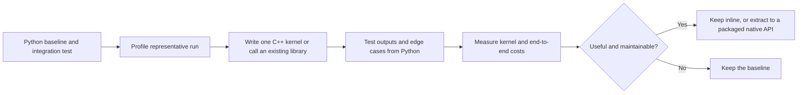

# Why cppyy_kit still helps when AI writes code

## Core argument

AI tools can write C++, Python, build files, and bindings. That reduces the cost of
typing boilerplate, but it does not remove the native library, compiler, packaging,
ABI, conversion, or lifetime decisions behind that code. A useful tool should reduce
the number of artifacts that must be created and kept in sync, and make it easier to
test the result from the Python workflow that already exists.

`cppyy_kit` is a small set of conveniences around cppyy: library setup, callbacks,
array conversion, lifetime helpers, and cached C++ functions. cppyy parses C++
headers and creates bindings at run time. The `@cpp` helper adds a focused way to
write a C++ function in a Python file, describe its arguments with annotations, and
compile/cache it when first called. This leaves Python in charge of files, devices,
ROS nodes, and experiment control, while C++ handles computation identified by profiling.
Its value is clearest when Python already owns the workflow and a particular
operation needs direct access to C++ code or libraries.

## What the alternatives solve

| Family | Typical fit | Cost to account for |
|---|---|---|
| [Numba](https://numba.readthedocs.io/en/stable/user/jit.html) | Compile eligible Python functions, often numerical loops, with JIT specialization. | The supported Python and data model is constrained by compilation mode. It is a strong fit when the computation can stay in that model. |
| [Cython](https://cython.readthedocs.io/en/latest/src/quickstart/overview.html) | Add static types to Python-like code, expose C/C++ libraries, or build extension modules. | Generated C/C++ and a compiled extension become part of the package workflow. Cython is also a good long-term choice for maintained modules. |
| [Pythran](https://pythran.readthedocs.io/en/latest/) | Ahead-of-time compile a supported subset of Python, especially numerical code, to a native module. | Source annotations, supported-subset constraints, and a native-module build step. |
| [Taichi](https://docs.taichi-lang.org/docs/kernel_function) | Write parallel kernels in its Python-embedded language for CPU/GPU execution. | Kernel scope and type rules differ from ordinary Python; it is useful when its execution model and backends fit. |
| [JAX](https://docs.jax.dev/en/latest/jit-compilation.html) | Compile array computations through `jax.jit`, with specialization and accelerator support. | The computation needs to fit JAX tracing and array semantics; first compilation and specialization matter. |
| [pybind11](https://pybind11.readthedocs.io/en/stable/) or [nanobind](https://nanobind.readthedocs.io/en/latest/) | Build a deliberate Python API around C++ functions and classes. | Write binding declarations, build an extension, and package and maintain the result. This is often right for a stable public module. |
| [CPython C API](https://docs.python.org/3/extending/extending.html) | Implement an extension module or Python-facing native types at a low level. | Fine-grained control comes with explicit conversion, reference, error, and build responsibilities. |
| [`ctypes`](https://docs.python.org/3/library/ctypes.html) | Call functions in shared libraries through a C-compatible ABI. | It needs exported C-compatible functions and explicit signatures. It cannot directly bind arbitrary C++ classes, templates, or overloaded methods. |

These families overlap, but they do not have the same goal. `Numba`, Cython,
Pythran, Taichi, and JAX provide different ways to express computation for a
compiler. pybind11, nanobind, and the CPython API expose native code as a Python
module. `ctypes` calls a C interface. cppyy is useful when the desired code is
already C++, when an installed library is the target, or when the experiment itself
is easiest to keep as ordinary Python plus a short C++ body.

For a conventional extension, an author may create C++ implementation files,
binding declarations or C wrappers, build configuration, and Python packaging, then
keep those pieces aligned as the API changes. Build tools can include CMake,
setuptools, scikit-build, or Meson; not every route needs CMake. A `ctypes` design
may avoid extension-module glue, but still needs a shared library with a C ABI and
careful signatures. cppyy can read headers for a compatible installed library and
generate bindings at runtime, so a project may not need a separate binding layer
for each experiment. It still needs a working compiler/runtime, headers, libraries,
and compatible binaries. Its runtime binding generation is not the absence of
binding work in every sense.

## Practical reasons to use it

### Keep experiments close to their real inputs

- Test a kernel on arrays, messages, point clouds, or images produced by the real
  Python application, instead of first creating a separate test executable.
- Change a threshold, cost function, interpolation rule, or planner parameter in
  the same script that launches the experiment.
- Compare several candidate formulas or planner settings without changing the
  surrounding node, file reader, visualizer, and logging path.
- Keep camera, ROS, UI, and orchestration code in Python when those parts are not
  the measured bottleneck.
- Use existing C++ classes directly when a library already has the behavior needed.
  A wrapper can be added for awkward conversions or ownership, but every method
  does not need a hand-written Python binding.

### Change one operation at a time

- Start with one profiled loop or operation, not a broad rewrite. The
  [acceleration workflow](skills/cppyy-accelerate/SKILL.md) profiles first,
  keeps the old computation as a reference, then tests and measures the replacement.
- A compact experiment can give an AI coding tool fewer separate artifacts and file
  contracts to coordinate: the Python call site, annotations, and C++ body are
  visible together, which makes the proposed change easier to review.
- The existing Python implementation and its functional tests constrain the change
  with concrete inputs and expected behavior. An AI tool can help propose edge
  cases or edits, while the test remains the check on the result.
- The native body uses ordinary C++ syntax and can work with C++ headers and
  existing algorithms. That gives an AI tool repository code and familiar C++ APIs
  to adapt instead of asking it to express every kernel in a new syntax.
- Keep the public Python call shape stable while moving only the implementation of
  the selected operation.
- **Author's testing priority:** for behavior-preserving experiments, I prioritize
  functional and integration tests from the existing Python workflow. They exercise
  actual inputs and the surrounding pipeline, making a useful reference for both
  changes written by people or AI tools.
- Add small unit tests for the boundary itself: dtype and layout checks, conversion
  errors, lifetime behavior, and cache key behavior. These complement the workflow
  tests and define focused contracts an AI coding tool can help exercise and a
  reviewer can inspect.
- Compare numerical outputs with exact equality where appropriate, otherwise state
  a tolerance. Test empty inputs, non-contiguous arrays, read-only arrays, precision
  boundaries, and repeated calls when those conditions are part of the API.
- Benchmark the end-to-end operation as well as the kernel. Include Python-to-C++
  conversion, copies, and result conversion; measure first-use compilation
  separately from warm calls. A faster loop can lose overall if the boundary costs
  dominate.
- Use the compile cache to avoid recompiling unchanged function bodies in later
  runs. Automatic precompiled headers can reduce header parsing for supported
  setups, but neither removes compiler requirements or all first-use costs. See
  [cache and PCH behavior](docs/FREEZE.md).
- If the prototype proves valuable, move it into a normal C++ library or extension
  later. The function body is already C++, but extraction still requires choosing
  headers and dependencies, making generated values such as `data_size` explicit
  C++ parameters, defining a stable API, adding bindings or a C ABI, and packaging
  it.

The code remains native code. cppyy cannot make arbitrary invalid C++ safe from
process crashes. Buffer validation can reject unsupported arrays, but it cannot
settle every ownership question for C++ objects that outlive Python references.
Those boundaries still deserve direct tests and clear ownership rules.

## A small workflow

For an inline kernel, `@cpp` puts the C++ body in the function docstring and uses
annotations to choose scalar or array conversion. For example, the README's
`sum_sq` imports `NDArray` from `cppyy_kit.numpy_types` and uses it to pass a
writable `double*` buffer; the first call compiles and later runs may load the
cached code. Array buffers have layout
and dtype requirements, while sequence arguments copy into temporary owned
storage. For a read-only kernel, `ConstNDArray[np.float64]` passes a
`const double*`; import it from the same module. See the
[current interface guide](docs/COMMON_PATTERNS.md) and
[README example](README.md#2-write-a-c-function-in-python). New annotation forms
should be labelled source-checkout-only until their version is published.

## Claims and evidence

Good claims are narrow: a named operation, named baseline, input size, environment,
correctness condition, timing method, and whether the run is cold or warm. Existing
examples include the [webcam tracker report](docs/webcam_demo/REPORT.md), which compares
a C++ patch-tracking kernel with a Python loop, and the
[benchmark collection](docs/benchmarks.md), which records commands and workload details.
They show benefits for those workloads and configurations. Other programs need
their own profile and comparison.

The clearest demonstration is an existing workflow before and after one measured
hot path moves to C++. Show matching outputs, the code difference, warm and cold
costs, and the total pipeline timing. If the example compares against a library
that already performs work in C++, include that control too; orchestration alone
may account for only a small difference. Do not present a kernel-only microbenchmark
as an end-to-end result.

## Demonstration ideas

- **Inline kernel:** start with a Python/NumPy per-point or per-keypoint loop, keep
  its functional test, then compare the same run with one `@cpp` implementation.
  Report conversion time and total frame time alongside kernel timing.
- **Existing library:** load a C++ library and its headers from Python, then call a
  real operation with no per-method binding file. Show where a thin helper is still
  needed for conversion or lifetime.
- **Parameter search:** run multiple candidate cost or threshold settings against
  one fixed dataset, with Python handling the sweep and C++ handling the repeated
  kernel. Report the dataset and repeat count.
- **Extraction path:** take a successful prototype and identify the concrete work
  needed to package it as a stable extension. This makes the prototype-to-product
  boundary visible without claiming extraction is automatic.

## When another approach fits better

- Use Numba or JAX when the operation fits their supported Python or array model and
  their compiler and execution model match the target workload.
- Prefer pybind11, nanobind, Cython, or another built extension when the interface
  is stable and public, and a packaged module with a predictable runtime is useful
  to downstream users.
- Use `ctypes` when the library already exposes a small, stable C ABI. For a C++
  API, a C-compatible wrapper and shared library must exist or be created.
- cppyy still needs a compatible compiler/runtime, headers, native libraries, and
  environment. Account for those dependencies and first-use compilation when
  choosing it.

Choose examples from measured repository reports and link the exact report and
command. Report measured conditions and costs so readers can judge whether the
same approach fits their workflow.
