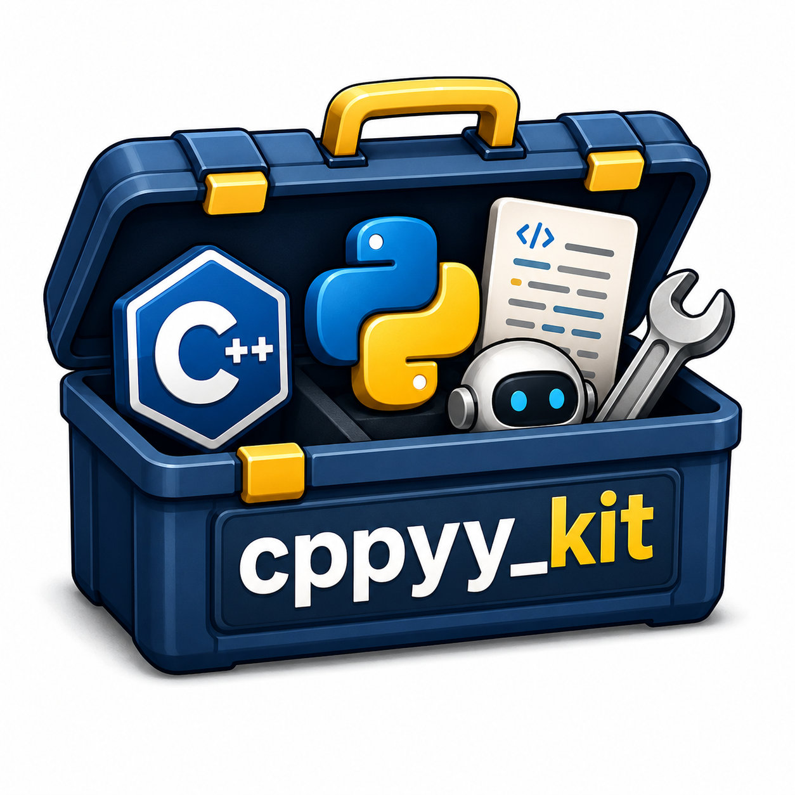

# cppyy_kit

[](https://github.com/awesomebytes/cppyy_kit/actions/workflows/ci.yml)

**Drive C++ robotics libraries from Python with cppyy.**

cppyy_kit provides Python interfaces to C++ robotics libraries through
[cppyy](https://cppyy.readthedocs.io). For supported APIs, cppyy reads installed
headers and JIT-compiles wrappers, so a separate binding or extension build is not
usually needed for each library. Kits expose selected native APIs and provide
helpers for data conversion and object lifetime. The libraries, headers, and other
native dependencies must be installed in the environment.

The suite includes options to reduce repeated header parsing and wrapper compilation,
and to write selected hot paths in C++. Results below link to the corresponding
benchmarks; measurements depend on the machine, environment, and workload.

<p align="center">
  
</p>

## Three ways to mix Python and C++

**Drive BehaviorTree.CPP from Python.** The C++ engine parses the XML, owns the tree,
and ticks it through cppyy:

```python
import bt_kit
bt = bt_kit.bringup_bt()
tree = bt.BehaviorTreeFactory().create_tree_from_text(xml)   # the C++ factory
tree.tickWhileRunning()                                      # the C++ engine ticks
```

**Write an inline C++ kernel.** The decorated function's docstring is its C++ body;
its annotations define argument marshaling. By default the compiled artifact is
cached; a compatible cache hit avoids recompiling the wrapper:

```python
import numpy as np
from cppyy_kit import cpp

@cpp
def sum_sq(data: cpp.arr("float")) -> float:      # numpy -> (float* data, size_t data_size)
    "double s = 0; for (std::size_t i = 0; i < data_size; ++i) s += data[i]*data[i]; return s;"

sum_sq(np.array([1, 2, 3], np.float32))            # 14.0 — no manual ctypes conversion
```

**Run independent kernels concurrently.** `@cpp(nogil=True)` releases the GIL around
the C++ body, allowing other Python threads to run during that work. On the 16-core
test machine, the eight-job CPU-bound example took about **150 ms with the GIL held
and 20 ms with it released** (about **7.7×**). The
[runnable example](examples/parallel_demo/parallel_demo.py) has the full version:

```python
import threading, numpy as np
from cppyy_kit import cpp

@cpp(nogil=True)                                   # the compiled body runs with the GIL released
def crunch(out: "double*", slot: int, iters: int) -> None:
    "double s = 0; for (std::size_t k = 1; k <= (std::size_t)iters; ++k) s += 1.0/(double(k)*1e-3 + 1.0); out[slot] = s;"

out = np.zeros(8)                                                    # 8 independent jobs, one slot each
threads = [threading.Thread(target=crunch, args=(out, i, 20_000_000)) for i in range(8)]
for t in threads: t.start()
for t in threads: t.join()                                          # wait for all 8 jobs
```

`@cpp(nogil=True)` releases the interpreter lock around the compiled body, so only
cppyy's argument/result marshaling stays under the lock. The C++ shim restores the
lock on normal return and when a C++ exception unwinds. The jobs are independent and
write into distinct C++ slots, so none needs the GIL while computing.

`cppyy_kit` provides shared utilities for library loading, callback lifetimes, C++
templates, and ownership. Domain kits build on these utilities and document the native
APIs and conversions they support.

## Install

**Published.** The suite ships as 11 conda packages on the prefix.dev
`awesomebytes` channel (browse: <https://repo.prefix.dev/awesomebytes>). Each package
contains a pure-Python (`noarch`) wrapper; its C++ dependency is a run dependency the
solver pulls in. The package recipes currently target Python 3.12 on Linux x86_64
and ARM64. `cppyy-kit` constrains Cling's compiler/runtime ABI to versions verified
by fresh import and C++ compilation. Linux ARM64 also needs the separately built,
architecture-specific `cppyy` bridge described in
[`recipe/cppyy/README.md`](recipe/cppyy/README.md); this is an additional runtime
package beyond the eleven kits. `cppyy-kit` and `wbc-kit` are distro-free; the
ROS-touching kits are published as `ros-jazzy-*`.

```toml
# pixi.toml
[workspace]
channels = ["https://prefix.dev/awesomebytes", "robostack-jazzy", "conda-forge"]
platforms = ["linux-64"]

[dependencies]
cppyy-kit = "*"                  # ROS-free base (cppyy only)
wbc-kit = "*"                    # Crocoddyl custom action models (ROS-free)
ros-jazzy-rclcpp-kit = "*"       # rclcpp core: bringup, messages, tf, rosbag2
ros-jazzy-bt-kit = "*"           # BehaviorTree.CPP v4
ros-jazzy-pcl-kit = "*"          # Point Cloud Library
ros-jazzy-ompl-kit = "*"         # Open Motion Planning Library
ros-jazzy-nav2-kit = "*"         # Nav2 algorithm cores
ros-jazzy-moveit-kit = "*"       # MoveIt 2
ros-jazzy-control-kit = "*"      # ros2_control
ros-jazzy-cv-kit = "*"           # OpenCV C++ (zero-copy Image->cv::Mat)
ros-jazzy-dbow-kit = "*"         # DBoW2 loop closure (run build-dbow2 once)
```

Or add one at a time:
`pixi add -c https://prefix.dev/awesomebytes -c robostack-jazzy -c conda-forge ros-jazzy-bt-kit`.
Install only what you need — every kit pulls `cppyy-kit`, and the ROS-touching kits
pull `ros-jazzy-rclcpp-kit`, transitively. To hack on the suite instead, see
[Getting Started](https://awesomebytes.github.io/cppyy_kit/getting-started/).
The Pixi example above targets `linux-64`; use the matching native platform and
ROS dependencies for an ARM64 environment.

## Showcase

### The kits — a C++ library each, driven from Python

| Kit | What it drives | Headline |
|---|---|---|
| **[cppyy_kit](docs/COMMON_PATTERNS.md)** (base) | the ROS-free machinery: loading, callbacks, lifetime, `@cpp`, `require`, `nogil`, [freeze & compile cache](docs/FREEZE.md) | PCL VoxelGrid: 632 ms JIT, 91 ms cache miss, 89–94 ms cache hits [↗](docs/benchmarks.md#pcl-compile-cache--frame-0-first-use-jit-vs-cached) |
| **[rclcpp_kit](rclcpp_kit/WHY.md)** | rclcpp (ROS 2 core): bringup, messages, tf, rosbag2, CDR | shared-host TF characterization observed 7.4–16.9× Python/C++ CPU ratios; no portable claim [↗](docs/benchmarks.md#tf-ingest--c-tf2-listener-vs-python-callback) |
| **[bt_kit](bt_kit/WHY.md)** | BehaviorTree.CPP v4 | Groot2-compatible trees from Python; cache 218→62 ms [↗](docs/benchmarks.md#bt_kit-compile-cache--t01-cold-run-adoption) |
| **[pcl_kit](pcl_kit/WHY.md)** | Point Cloud Library (no maintained binding) | **15.1× latency / 7.4× CPU** at 74-LOC parity [↗](docs/benchmarks.md#pcl-showcase--cloud-stays-in-c-end-to-end) |
| **[ompl_kit](ompl_kit/WHY.md)** | Open Motion Planning Library | Python validity-checker in the planner's inner loop, no codegen [↗](ompl_kit/REPORT.md) |
| **[nav2_kit](nav2_kit/WHY.md)** | Nav2 algorithm cores, composed from Python | the real RegulatedPurePursuit with **no lifecycle servers / no pluginlib** [↗](nav2_kit/REPORT.md) |
| **[moveit_kit](moveit_kit/WHY.md)** | MoveIt 2 native APIs through cppyy | robot models, planning, and kinematics [↗](moveit_kit/REPORT.md) |
| **[control_kit](control_kit/WHY.md)** | ros2_control | Python controllers in `controller_manager` [↗](control_kit/REPORT.md) |
| **[cv_kit](cv_kit/WHY.md)** | OpenCV C++ | zero-copy `sensor_msgs/Image` → `cv::Mat`, one CUDA branch point [↗](cv_kit/REPORT.md) |
| **[dbow_kit](dbow_kit/WHY.md)** | DBoW2 place recognition (no binding, not on conda-forge) | vendored, compiled once, loop closure from short Python [↗](dbow_kit/REPORT.md) |
| **[wbc_kit](wbc_kit/WHY.md)** | Crocoddyl custom action models | inline-C++ model, **no build system** [↗](docs/benchmarks.md#wbc--custom-crocoddyl-action-model-python-derived-vs-inline-c) |

Each kit is a package with its own Python module, `demos/`, `tests/`, optional
`cpp/`, and a `WHY.md` (the rationale) / `REPORT.md` (the evidence) / `SKILL.md`
(LLM-facing cheat sheet) trio — the anatomy in [`docs/ARCHITECTURE_V2.md`](docs/ARCHITECTURE_V2.md).

### Demos & examples

Every headline links to the exact row that produced it in
[docs/benchmarks.md](docs/benchmarks.md).

| Demo | What it proves | Headline number |
|---|---|---|
| [Live webcam A vs B](docs/webcam_demo/REPORT.md) | a hand-written NCC tracker in one inline-C++ kernel vs the identical NumPy loop | **16.18×** @ 640×480 [↗](docs/benchmarks.md#webcam-demo--a-cppyy_kit-c-vs-b-naive-python) |
| [IK 5-solver bench](docs/ik_bench/WHY.md) | benchmark C++-only IK solvers (incl. unpackaged bio_ik/pick_ik) from *one* Python file | pure-Python **10–25× slower**; bio_ik 991 solve/s [↗](docs/benchmarks.md#ik-benchmark--same-panda-same-200-targets-per-solver-subprocess) |
| [WBC inline-C++ model](docs/wbc/REPORT.md) | a custom Crocoddyl action model authored inline, JIT-compiled, no CMake | **22.9×** vs Python-derived, bit-identical cost [↗](docs/benchmarks.md#wbc--custom-crocoddyl-action-model-python-derived-vs-inline-c) |
| [Retargeting teleop rig](docs/retarget_pipeline/REPORT.md) | webcam → body/hand tracking → TF → whole-body retarget onto G1/Talos, live, one Rerun viewer | glue kernel **341.5×**, /tf marshaling **258.9×**, bit-identical [↗](docs/benchmarks.md#retarget-pipeline--perception-tf-marshaling--retarget-glue-kernel) |
| [Visual loop closure](docs/tutorials/vision_loop_closure.md) | ORB + DBoW2 + GTSAM front-end in short Python; image data remain in C++ in this pipeline | 1080p ingest **135.8×**; 19 loops, precision/recall 1.00/0.95 [↗](docs/benchmarks.md#vision--cv_kit--dbow_kit-synthetic-sequence) |
| [Jitter bench](docs/jitter_bench/REPORT.md) | a ~1 kHz control loop orchestrated from Python on a *stock* kernel | **~2 µs median** period, unprivileged [↗](docs/benchmarks.md#jitter-bench--reduced-reference-set-a1--b--c-idle-60-s-each) |
| [cppyy-accelerate skill](skills/cppyy-accelerate/SKILL.md) | point a coding agent at slow Python; it moves the hot path to a kit | **16.3×** (49.6 → 3.04 ms), output bit-identical [↗](docs/benchmarks.md#accelerate--the-llm-skill-worked-example) |

### Where the speedups apply — and where they don't

The webcam gap is large because the hot per-frame stage is a hand-written per-pixel
NCC tracker with no OpenCV one-liner. When the per-frame work is only
library-provided ops (ORB, RANSAC — `cv2` is already C++), the same A-vs-B
comparison narrows to ~1.1–1.2×
([webcam report](docs/webcam_demo/REPORT.md#the-a-vs-b-table)).

In the retargeting rig, the measured cppyy wins are the `/tf` message marshaling and
the transform/retarget kernel. The IK solve runs on pinocchio's own Python bindings:
instantiating `pinocchio::Model` from headers under Cling trips boost 1.90's variant
template-arity limit (pinocchio's 25-type joint `boost::variant`), so that path
cannot be JIT-parsed
([retarget report](docs/retarget_pipeline/REPORT.md#the-cppyy_kit-win-here-retarget-glue-and-the-honest-boundary-on-the-solve)).

The benchmarks ran on a shared development machine, so the ratios are more repeatable
than the absolute times.

## The optimization ladder

Available options include reducing startup work and moving selected hot paths to C++:

- **Prototype (L0).** Plain Python driving the kit. Headers are parsed and
  per-signature wrappers JIT-compiled on first use. Fastest to write.
- **Accelerate.** Move the hot path onto C++ via a kit, `@cpp`, or `nogil` — 15.1×
  lower latency in the
  [PCL pipeline benchmark](docs/benchmarks.md#pcl-showcase--cloud-stays-in-c-end-to-end),
  where the cloud stays in C++ end to end at 74-LOC parity.
- **Freeze.** With the auto-PCH hook installed and a matching PCH available, Cling
  loads cached headers at startup instead of parsing them again. In one shared-host
  rclcpp measurement, bringup took ~1.73 s cold and 0.064 s warm (~27×); this is not a
  portable startup estimate. See the
  [auto-PCH measurement](docs/benchmarks.md#auto-pch--zero-config-cold-vs-warm-bringup).
  The compile cache can reuse compatible `@cpp`/`cppdef` artifacts. For the PCL
  VoxelGrid benchmark, JIT took 632 ms, a cache miss took 91 ms, and cache hits took
  89–94 ms [↗](docs/benchmarks.md#pcl-compile-cache--frame-0-first-use-jit-vs-cached).
- **Lower (L2).** A proven-hot leaf is authored as a native C++ node — 22.9× on the
  [WBC Crocoddyl action model](docs/benchmarks.md#wbc--custom-crocoddyl-action-model-python-derived-vs-inline-c)
  (bit-identical cost), removing the per-call cppyy boundary.

Read the full ladder in [`docs/FREEZE.md`](docs/FREEZE.md) and the 36 documented
patterns behind it in [`docs/COMMON_PATTERNS.md`](docs/COMMON_PATTERNS.md).

## Powers rclcppyy

`rclcpp_kit` is the capability layer under
[**rclcppyy**](https://github.com/awesomebytes/rclcppyy) — the drop-in accelerator
that lets an existing rclpy program run ROS 2's C++ core (rclcpp, tf2, rosbag2, CDR
serialization) with minimal changes. rclcppyy 0.2.0 is now thin re-export shims over
`rclcpp_kit`, and installs from the same channel as `ros-jazzy-rclcppyy`. If you have
an rclpy node paying Python for work that is fundamentally C++ (TF ingest, per-message
marshaling), `rclcpp_kit` moves that work into C++.

## Built for LLM agents

Agent-consumability is a design goal:

- Every kit ships a `SKILL.md` — a compact, LLM-facing cheat sheet of its real API.
- [`docs/COMMON_PATTERNS.md`](docs/COMMON_PATTERNS.md) is the shared playbook (36
  patterns) a coding agent reads before writing a new kit or a new call.
- The [`cppyy-accelerate`](skills/cppyy-accelerate/SKILL.md) skill is a
  Claude-Code-consumable procedure — **PROFILE** (a cProfile + boundary-tracer),
  **MAP** (hotspot shape → the right kit/pattern, with a list of when not to use it),
  **APPLY** (a minimal diff per the kit `SKILL.md`), **VERIFY** (tests-as-contract +
  a before/after table). Its [worked example](skills/cppyy-accelerate/WALKTHROUGH.md)
  accelerates a naive voxel downsampler **16.3×** with bit-identical output.

## Docs

Full documentation site: **<https://awesomebytes.github.io/cppyy_kit/>**

- [The Patterns](docs/COMMON_PATTERNS.md) — the canonical cppyy playbook (36 patterns).
- [Freeze & Cache](docs/FREEZE.md) — the L0 → L1 → L2 + compile-cache ladder.
- [Benchmarks](docs/benchmarks.md) — reported results with commands and conditions;
  see linked reports for run-specific context.
- [Architecture](docs/ARCHITECTURE_V2.md) — how the suite is put together.
- [Tutorials](docs/tutorials/vision_loop_closure.md) — end-to-end walkthroughs.
- Per kit: its **Why** (the pitch), **Report** (the evidence), **Skill** (LLM cheat sheet).

Questions, ideas, and bug reports are welcome on the
[issue tracker](https://github.com/awesomebytes/cppyy_kit/issues).

## License

BSD 3-Clause — see [`LICENSE`](LICENSE).
