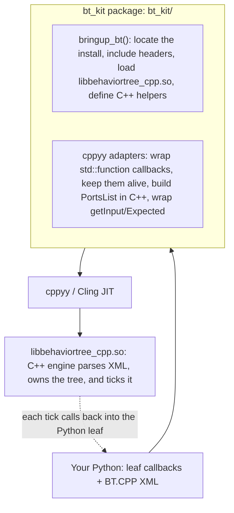

# bt_kit: BehaviorTree.CPP v4 from Python via cppyy

**Date:** 2026-07-10 · **Env:** pixi `bt` (robostack-jazzy + conda-forge),
`ros-jazzy-behaviortree-cpp 4.9.0`, `cppyy 3.5.0`, Python 3.12.13, linux-64.
**Question:** Can Python run the official BehaviorTree.CPP tutorials on the C++
tree engine without an official binding? `py_trees` is a separate library and is
not compatible with BehaviorTree.CPP.

**Result:** Yes. The kit can run these tutorials. Some direct cppyy operations
segfault, so the kit must hide those operations from users. The v0 API follows the
C++ API. See §2.

(For the motivation and a C++-vs-Python side-by-side, see [WHY.md](WHY.md); for the
API, see [SKILL.md](SKILL.md).)

---

## How the kit works



Bringup locates the install, JIT-includes the headers, and loads the `.so` so
calls resolve. The kit wraps Python callables as `std::function`s
(pinned alive), builds the port list in a C++ helper (Python construction
segfaults, see §1), and unwraps `getInput`/`Expected<T>` behind a small node
object. The engine parses the XML and ticks; each tick calls back into the
Python leaf.

Each kit follows these steps. First, locate the install, include its headers, and
load its shared libraries. Second, handle cppyy limitations in C++, such as STL
container construction and callbacks that cross the language boundary. Third,
expose the library's API names so users can apply their existing knowledge.
bt_kit uses about 180 lines of Python and a 40-line C++ helper.

---

## 1. Capability probe results

Each capability was probed in isolation from the `bt` env against the installed
4.9.0 headers/library.

| # | Capability | Possible? | How / why |
|---|---|:--:|---|
| 1 | Basic tree: built-in nodes, `createTreeFromText`, `tickWhileRunning` | **YES** | `BT::BehaviorTreeFactory` constructs, parses XML, ticks. Clean. |
| 2 | Python action leaf via `registerSimpleAction` | **YES** | Python callable wrapped in `std::function<NodeStatus(TreeNode&)>`, pinned alive. Ticks and returns status correctly. |
| 3 | Ports + blackboard: `InputPort`/`OutputPort`, `getInput<T>`/`setOutput<T>`, `{bb}` remap | **YES** | Template member calls `node.getInput['std::string'](key)` / `setOutput` work. **But** the `PortsList` (`unordered_map<string,PortInfo>`) must be built in a **C++ helper**, constructing/inserting it from Python **segfaults** cppyy's `MapFromPairs`. |
| 4a | Cross-inheritance: Python class deriving `BT::StatefulActionNode` | **NO** | cppyy's Python-override dispatcher regenerates *all* virtuals, but `StatefulActionNode::tick()`/`halt()` are `final` → `TypeError: no python-side overrides supported (failed to compile the dispatcher code)`. |
| 4b | Stateful/async via a JIT'd C++ shim holding `std::function` hooks | **YES** | `cppyy.cppdef` a `StatefulActionNode` subclass with `std::function` slots for `onStart/onRunning/onHalted`; the builder lambda lives entirely in C++ so the `unique_ptr` never crosses into Python; only the hooks cross. Multi-tick RUNNING→SUCCESS works. |

**One hard failure (4a), one workaround-required (3), everything else clean.**

### Limitations
- Building the `PortsList` map in Python **crashes the interpreter** (SIGSEGV,
  no Python traceback). Building it in a one-line C++ helper avoids this crash.
- Returning `std::unique_ptr<TreeNode>` *from a Python* `std::function` builder
  fails (`C++ type cannot be converted to memory`). Keeping the builder lambda in
  C++ (Python only supplies the `std::function` hooks) sidesteps it.
- Keep-alive is mandatory: unpinned functors → `callable was deleted` at tick
  time. The kit pins them on the factory and carries them to the tree.
- **Interpreter-exit teardown** (relevant to the mixed-tree demo `t03`, which
  drives rclcpp from inside a tick): the demo previously hard-exited via
  `os._exit(0)` to dodge a feared static-destructor segfault at shutdown. A
  root-cause pass found **no reproducible crash** on the current stack, so the
  dodge is gone, `t03` now exits on a normal `sys.exit`. rclcppyy registers an
  **ordered teardown** (`rclcppyy.shutdown_rclcpp` on `cppyy_kit`'s atexit hook)
  that brings the rclcpp context / DDS layer down before Python finalization. See
  COMMON_PATTERNS.md §14 for the evidence; `test/test_clean_exit.py` is the
  tripwire. bt_kit itself holds no process-global C++ state, so it registers no
  teardown of its own.

---

## 2. API design

The v0 API mirrors the C++ library 1:1: `bringup_bt()` returns the patched `BT`
namespace and you use `BehaviorTreeFactory`, `registerSimpleAction` /
`registerSimpleCondition`, `createTreeFromText`, `tickWhileRunning` by their real
C++ names (snake_case aliases exist too), writing the leaf callbacks in Python.
Status is `bt.NodeStatus.SUCCESS` (the C++ enum) or the `bt_kit.SUCCESS` integer;
the values compare equal. Stateful nodes need a separate API because C++
`registerNodeType<T>()` requires a type defined in C++. The kit adds
`factory.register_stateful(name, PyClass, ports)` whose class exposes
`onStart`/`onRunning`/`onHalted`. See [WHY.md](WHY.md) for the complete
C++-vs-Python side-by-side and [SKILL.md](SKILL.md) for the API.

**Considered and rejected: a sugared decorator DSL** (`@action_node(...)` +
`tree_from_xml`). It was ~2 LOC shorter on tutorial 1 but relied on a module-global
  registry (hidden state shared across trees, imports, and tests) and forced a
kit-specific DSL the reader must learn instead of reusing existing BT.CPP
knowledge. The direct API reuses BT.CPP knowledge and has no hidden state. The
decorator was dropped, and no decorator code ships.

---

## 3. Glue size, bringup time, and demo size

| Metric | Value |
|---|---|
| Kit module `bt_kit/bt_kit/` | 295 lines total (223 code), including a **~40-line embedded C++ helper** (`cppdef`) and about 180 lines of Python glue |
| JIT `cppyy.include("behaviortree_cpp/bt_factory.h")` | **~0.85 s** (one-time) |
| Full `bringup_bt()` (include + `load_library` + `cppdef` + factory patch) | **~0.85 s** (one-time, idempotent) |
| Per-tree registration | under 1 µs in the measured run |

Bringup takes about 0.85 s, compared with about 2.5 s for rclcpp bringup. BT.CPP's
headers are smaller than `rclcpp/rclcpp.hpp`.

Official tutorials, XML verbatim, leaves in Python. LOC excludes the XML string,
comments, docstrings, blank lines.

| Demo | User Python LOC | What it exercises |
|---|:--:|---|
| `t01_first_tree.py` | **24** | 4 leaves (1 condition + 3 actions), Sequence, tick |
| `t02_ports.py` | **16** | input port read, output port write, `{blackboard}` roundtrip |

Verified output:
```
# t01
[ Battery: OK ]
GripperInterface::open
ApproachObject: approach_object
GripperInterface::close
# t02
Robot says: hello world
Robot says: The answer is 42
```

---

## 4. Runtime metrics

Fixed tree: `Sequence` of 3 leaves each returning SUCCESS immediately. One tick =
one full traversal. 2 s warm window per variant, JIT/bringup excluded. One run on
this machine (indicative, not statistically rigorous):

| Variant | ticks/s | µs/tick |
|---|--:|--:|
| (a) C++ JIT leaves (engine + leaves at C++ speed) | ~1,280,000 | ~0.78 |
| (b) Python leaves through bt_kit | ~630,000 | ~1.58 |
| (c) pure-Python sequence loop (no C++ engine) | ~7,700,000 | ~0.13 |

**Results:**
- Crossing into Python per leaf costs **~2x** vs C++ leaves (~0.3 µs of boundary
  cost per leaf). This overhead is small for orchestration.
- The C++ engine is **~10x slower than a trivial 3-item Python loop** for this
  degenerate tree. The C++ engine therefore does not improve speed for tiny trees.
  Its per-tick cost (node traversal, status propagation,
  blackboard) dwarfs a bare loop. Its value is the *engine* (reactive/parallel
  control nodes, decorators, XML authoring, logging, Groot), not tick throughput.
- (c) is a **floor**, not a fair py_trees stand-in: py_trees (a real pure-Python
  BT with tree/blackboard semantics) carries its own traversal overhead and would
  run much slower than this trivial loop, perhaps near or below (b). py_trees is **not
  packaged** for robostack-jazzy/conda-forge (`pixi search` finds nothing), so the
  apples-to-apples contrast was dropped; (c) stands in as "what you'd hand-write
  without the kit."

At ~630k ticks/s, Python-leaf trees tick far faster than any real robot control
rate (typically 10–1000 Hz), so the boundary cost is a non-issue in practice.

---

## 5. Follow-up review (2026-07-11)

The follow-up work addressed the v0 gaps. Evidence for the results is the kit test
suite `test/test_bt_kit.py` (7 tests; `pixi run -e bt test-bt` passes;
auto-skips without BT so the default suite stays 6 passed) plus the probes noted.
The measurements are provisional because another kit benchmark used the same machine.

| Gap | Result | Evidence |
|---|:--:|---|
| 1. Typed ports (int/double/bool/vectors) | **WORKS** | `ports={"count": int, "items": [float]}`; `get_input(k, int)` and `set_output` (type inferred). int/double/bool/`vector<double>` parsed from XML literals + typed blackboard roundtrip. `test_typed_ports_roundtrip`. |
| 2. Stateful multi-instance | **WORKS** | Builder calls back into Python per node → a fresh object per node instance (handle-dispatched). Two `<CountTo n="2"/"4">` keep independent counts. `test_stateful_multi_instance`. |
| 3. Observability | **WORKS** | `add_cout_logger` / `add_file_logger` (7.6 KB `.btlog`) / `observe().counts()` / `add_groot2_publisher`. The `.so` is built with ZMQ (libzmq linked); Groot2Publisher constructs and binds. `test_observer_counts`. |
| 4. GIL / Parallel + Reactive | **WORKS (characterized)** | Parallel and ReactiveSequence tick Python leaves on the single tick thread; a sleeping leaf releases the GIL and a background-thread spin does not deadlock (main thread ran 40 iters concurrently). Rules below. |
| 5. XML error ergonomics | **WORKS** | `BtXmlError` with one clean line (`RuntimeError: Error at line 4: -> Node not recognized: X`), no C++ signature details. `test_xml_error_is_readable`. |
| 6. Subtrees + v4 scripting/preconditions | **WORKS** | SubTree composition (needs `main_tree_to_execute`), `<Script code="x:=42"/>`, `_skipIf` preconditions, engine-side, free through the kit. `test_subtree_composition`. |
| 7. Kit tests + `test-bt` | **WORKS** | `test/test_bt_kit.py` auto-skips without BT (default suite: 6 passed / 7 skipped); `pixi run -e bt test-bt` → 7 passed. |
| 8. JIT→AOT "freeze" | **WORKS (L1 via Cling PCH)** | A prebuilt Cling PCH of the bt headers cuts `include(bt_factory.h)` ~890 ms → ~6 ms (~140×); same 16 tests green frozen. The dictionary route (below) was the dead end; the PCH is the answer. See `docs/FREEZE.md`. |

### GIL and concurrency (Gap 4)
- Kit leaves (SimpleAction/SimpleCondition, `register_stateful`) are always ticked
  in the tree's own thread. No leaf runs on a C++ worker thread, so the GIL does
  not block other BT leaves. BT's `ParallelNode` is cooperative bookkeeping, not OS
  threads: Python leaves under it run sequentially (no true parallelism, but no
  contention either).
- A leaf must not busy-block: return `RUNNING` and let the tick loop re-enter. A
  leaf that sleeps / does I/O releases the GIL and is safe even when the tree is
  spun from a background Python thread (verified: no deadlock).
- `ThreadedAction` is deliberately not exposed (it would run the callback on a C++
  worker thread and need explicit GIL handling).

### Residual gaps (still true)
- `registerNodeType<T>` for a Python `T` remains impossible → custom **control
  nodes / decorators** authored in Python still need a JIT'd C++ shim.
- Ports are bidirectional and string/scalar/vector-typed; **directioned**
  declarations and arbitrary **struct/JSON** port types need a C++ type (via
  `RegisterJsonDefinition`), so Python-defined struct ports aren't reachable.
- Groot2 publishing binds but was not verified against a live Groot2 GUI (none
  available locally, binding is the signal).
- Keep-alive discipline (pin Python callables) and the container-segfault rule are
  handled inside the kit; any raw-cppyy use reintroduces them.

### Gap 8: JIT and AOT freeze (L1 via a Cling PCH, 2026-07-11)
Bringup is **89% header JIT-parse**: `cppyy.include("bt_factory.h")` ~0.83–0.91 s,
`load_library` ~0.006 s, `cppdef(glue)` ~0.05 s, first factory+register+tick
~0.69 s. Two routes were tried:

**Dictionary (the dead end).** A ROOT dictionary (`rootcling` → `dict.cxx` +
`_rdict.pcm` + `.rootmap` → `.so`; `load_reflection_info` ~0.02 s) supplies
reflection/autoload metadata, **not a parsed AST**, with the dict loaded and no
`cppyy.include`, the first `BehaviorTreeFactory()` still cost ~0.8 s. The parse is
not eliminated.

**Cling PCH (the answer).** The mechanism cppyy uses for its own std headers: build
a precompiled header that bakes `bt_factory.h` on top of cppyy's std set
(`rootcling -generate-pch`, reusing `etc/dictpch/makepch.py`'s command with the kit
header + include path inserted), then point `CLING_STANDARD_PCH` at it. Cling
materialises the header AST from the PCH at interpreter start.
- **`include(bt_factory.h)` ~890 ms → ~6 ms (~140×); bringup total ~950 ms → ~90 ms
  (~10.7×); end-to-end t01 ~1.9 s → ~1.1 s (1.7×).** Same 16-test suite green
  frozen (`pixi run -e bt test-bt-frozen`).
- Two rules made it real: (1) `CLING_STANDARD_PCH` must be set *before the first
  `import cppyy`*, hence a launcher (`scripts/freeze/run_frozen.py`) that sets it
  and `exec`s the target; (2) the AST-only PCH doesn't emit the header's
  internal-linkage statics (`BT::UndefinedAnyType`) and the library's copy is a
  non-exported local symbol, so on the frozen path the kit emits one strong
  definition under the exact mangled name (applied only when frozen).
- **Not removed by the PCH:** the first-use JIT of cppyy's per-signature call
  wrappers (`registerSimpleAction`'s `std::function` thunk, ~0.7 s for t01,
  unchanged L0↔L1). A header PCH avoids repeated header parsing.
- Generalises: the same recipe takes `rclcpp/rclcpp.hpp` ~1.71 s → ~6 ms.

**Result: L1 works.** See `docs/FREEZE.md` for build steps, artifact lifecycle,
measurements, and limits. One leaf was also compiled to native C++ (L2) and tested
against the Python version (§6, "Next investments," item (a)).

### Gap 8b: compile cache removes first-use JIT (2026-07-11)

The first-use JIT the PCH could not touch is now **eliminated persistently** by the
compile cache. bt_kit's registration routes through a **trampoline** compiled
once into a cached `.so` (`cppyy_kit.cppdef_cached(..., trampoline=True)`): the
`std::function` thunk *and* the `registerSimpleAction`/`registerStateful` calls run
in compiled code, converting the `BT::TreeNode&` back to the Python proxy via
`CPyCppyy::Instance_FromVoidPtr`. bringup is `_adopt_glue()`; `register_*` branch on
`bt_kit._CACHED`, falling back to the cppyy `callback()` JIT path (with a one-time
notice) when no compiler/CPyCppyy toolchain is present. `warmup()` is then a no-op.

Measured (t01, cold subprocesses, `bench-cache-bt[-frozen]`):

| config | first register | first tick | end-to-end elapsed time |
|---|--:|--:|--:|
| L0 JIT | ~233 ms | ~8 ms | ~1770 ms |
| L0 + cache (run ≥2) | ~60 ms | ~5 ms | ~1200 ms |
| frozen JIT | ~278 ms | ~9 ms | ~970 ms |
| **frozen + cache (run ≥2)** | **~62 ms** | **~5 ms** | **~425 ms** (~4.1× vs L0 JIT) |

Run 1 pays a one-time ~2 s `.so` compile (per machine; skippable by shipping warm).
The residual ~60 ms is cppyy's call wrapper to the trampoline entry points, which is
cppyy-internal (not cacheable at this layer). Same 37 tests green on the cached path
and the JIT fallback; `docs/FREEZE.md` §4 has the mechanism.

---

## 6. Recommendation

The tests show that the official BT.CPP tutorials run with their original XML on
the C++ engine. Each demo uses 16–24 lines of Python for its leaves. Bringup takes
about 0.85 s. No maintained official Python binding is available. Stateful and
asynchronous nodes work through a C++ shim.

Two findings shape the API design:

- **Use the C++ API names.** `BehaviorTreeFactory` and the tree object use method
  names such as `registerSimpleAction`, `createTreeFromText`, and `tickWhileRunning`
  from the BT.CPP tutorials. This reduces the additional API concepts to learn.
- **Handle cppyy integration in the kit.** Container construction and
  `registerNodeType<T>` with `final` virtual methods caused crashes in the probes.
  The kit supplies C++ helpers for these tested cases.

The follow-up review (2026-07-11, §5) added typed ports, per-node state, loggers,
Groot2 and observer support, readable XML errors, subtrees, and tests that skip
when BT.CPP is unavailable. A Cling PCH reduces header parsing time by about 140x;
the tests also pass with the PCH enabled (§5 Gap 8, `docs/FREEZE.md`). One
leaf was compiled to native C++ (L2). Python-authored control and decorator node
types still need generated C++ shims.

**Next investments, in priority order:** (a) Python-authored control/decorator
nodes via generated C++ shims; (b) directioned + struct/JSON ports; (c) cut the
remaining first-use JIT (cppyy call-wrapper codegen, ~0.7 s for t01, the part the
header PCH does not touch) via cached instantiations or wider L2 lowering; (d) live
Groot2 verification.

---

## 7. Generic lessons for cppyy_kit

These generalized beyond BT.CPP and are now maintained as the shared,
library-independent catalog in **[../docs/COMMON_PATTERNS.md](../docs/COMMON_PATTERNS.md)**
(the recipe, keep-alive, function crossing both ways, container/segfault traps,
templates, GIL rules, error prettify, and the AOT/L1 finding), implemented in
`cppyy_kit/__init__.py` and confirmed by both bt_kit and pcl_kit. The
BT-specific evidence stays in this report (§1 probe matrix, §5 follow-up results,
§5 Gap 8 AOT probe).
