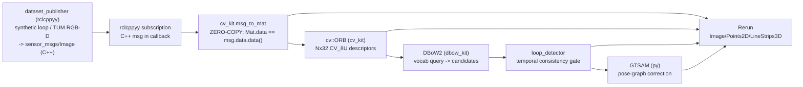

# Visual loop-closure front-end (ORB → DBoW2 → GTSAM) from Python via cppyy

**Date:** 2026-07-11 (v2: live-viewer default + GTSAM/cppyy retry) · **Env:** pixi
`vision` (robostack-jazzy + conda-forge), `opencv 4.13.0` (C++ libs + headers + cv2),
`rerun-sdk 0.34.1`, `gtsam 4.2.2`, `libboost-headers 1.90` (added in 4e179b7),
`tbb 2023.0.0` (runtime only, **no headers**), `cppyy 3.5.0`, Python 3.12.13,
linux-64; DBoW2 vendored + built from source.
**Scope:** implement the ORB-SLAM2 place-recognition and loop-closure front-end in a
Python ROS 2 node. The pipeline uses ORB features, DBoW2 place recognition, a
temporal-consistency gate, and an optional GTSAM pose graph. cppyy calls the C++
libraries, and Rerun displays the results.

The front-end runs from Python and uses each library's API. A rclcppyy subscription
receives a C++ `sensor_msgs::msg::Image`. `cv_kit` wraps its data as a `cv::Mat`
without copying it. C++ `cv::ORB` extracts descriptors, and DBoW2 performs place
recognition. A temporal gate confirms loops. The data stays in C++ through the DBoW2
query. GTSAM corrects the trajectory through its Python binding.

GTSAM cannot run through cppyy in this environment. The pose-graph stage uses GTSAM's
Python binding because it runs as a batch step, not once per frame. A cppyy retry
found two blockers: the environment has the TBB runtime but not its headers, and
Cling cannot materialize the static initializer for `DefaultKeyFormatter` in
`Key.h`, even when the required headers are supplied. See §5.

---

## How it fits together

Two kits + a shared detector, all mirroring the libraries' own APIs:
`cv_kit` (~365 LOC), `dbow_kit` (~243 LOC), `loop_detector` (~80 LOC).

---

## 1. Capability results

| # | Capability | Result | Evidence |
|---|---|:--:|---|
| 1 | **OpenCV bringup**: include core/imgproc/features2d, load `libopencv_*.so` | **WORKS** | JIT include ~0.18 s total (core 0.15 s), lib loads negligible. |
| 2 | **msg_to_mat zero-copy**: wrap a C++ `sensor_msgs::msg::Image::data` as `cv::Mat` | **WORKS** | `cv::Mat.data` pointer **identical** to `msg.data.data()`; aliasing verified by round-trip write. **First zero-copy-*in* across all kits.** |
| 3 | **cv::ORB** detectAndCompute from Python | **WORKS** | 500–1000 keypoints, descriptor **Nx32 CV_8U** (256-bit), ~3.7 ms/frame CPU. |
| 4 | **CUDA auto-detect** | **WORKS (absent→clean)** | conda-forge OpenCV has no `cudafeatures2d` → `cuda_available()` returns False, CPU path, no error. (A CUDA build is now available via Esri's channel, see `cv_kit/CUDA_OPENCV.md`; ~5.3× measured there; cv_kit needs no change.) |
| 5 | **DBoW2 build from source** | **WORKS (2 patches)** | Direct `$CXX` compile of 5 DLib-free ORB sources → `libDBoW2.so` (54 KB). See §2. |
| 6 | **DBoW2 vocab train / db query** via cppyy | **WORKS** | Small vocab (k=10,L=4) 9970 words in ~7 s; self-match score 1.0; query ~2.8 ms/frame. |
| 7 | **Real ORBvoc load** (`loadFromTextFile` patch) | **WORKS** | 971,814 words (k=10,L=6) parsed from the 145 MB text in ~2.3 s; binary cache 49 MB reloads in ~0.37 s (~6×). |
| 8 | **GTSAM via cppyy** (v2 retry, boost headers present) | **BLOCKED** | The Boost header issue is resolved. The remaining blockers are: (a) `config.h` sets `GTSAM_USE_TBB` → headers `#include <tbb/…>`, tbb *headers* absent from env; (b) with ABI-matched tbb headers supplied, headers JIT in ~2.6 s but the Cling ORC JIT then **fails to materialize** the static init of `static const KeyFormatter DefaultKeyFormatter` (`Key.h`, internal-linkage `std::function` global), a Cling limitation, not a missing dependency. See §5. |
| 9 | **GTSAM via Python binding** (pose-graph path) | **WORKS** | Pose-graph LM optimize; drift 2.19 m → 0.14 m mean error. |

The front-end probes passed. The GTSAM/cppyy probe remains blocked; the pose-graph
stage uses GTSAM's Python binding.

---

## 2. Build DBoW2 from source

DBoW2 is not on conda-forge and has no Python binding, so `dbow_kit/cpp/build_dbow2.py`
clones `dorian3d/DBoW2` into the gitignored `build/vendor/`, applies two documented,
idempotent in-place patches (never a fork), and compiles it directly, using the same recipe as
`scripts/freeze/build_l2_node.py`, avoiding DBoW2's CMake (which pulls an
`ExternalProject`/DLib path the ORB front-end never needs).

**Patch 1, compile only the DLib-free ORB sources.** DBoW2's ORB path (`FORB`,
`TemplatedVocabulary`, `TemplatedDatabase`, `BowVector`, `FeatureVector`,
`QueryResults`, `ScoringObject`) needs only OpenCV. `FBrief.cpp` (BRIEF) and
`FSurf64.cpp` (SURF) pull DVision/opencv-contrib and are **skipped**, so no DLib
clone is required. dbow_kit includes those specific headers rather than the umbrella
`DBoW2.h`, which would drag in `FBrief.h`.

**Patch 2, ORB-SLAM2-style text loader + binary cache in `TemplatedVocabulary.h`.**
Stock DBoW2 only reads its own `cv::FileStorage` YAML/gz; the canonical `ORBvoc.txt`
is a different text format ORB-SLAM2 added a loader for. We inject the same
`loadFromTextFile` plus a raw `saveToBinaryFile`/`loadFromBinaryFile` (so the ~145 MB
text parse is cached to a ~49 MB binary that reloads ~6× faster). Injected as inline
members after the public `load(...)` declaration, guarded by a marker for idempotency.

Two sharp edges hit and fixed, both worth noting as generic lessons:
- **Dependent-type template member needs `.template`.** `node.descriptor` is the
  template parameter `TDescriptor`, so `node.descriptor.ptr<unsigned char>()`
  fails to parse, it must be `node.descriptor.template ptr<unsigned char>()`. (In
  `FORB.cpp` the same call on a concrete `cv::Mat` needs no disambiguator.)
- **Reproducible training** needs `srand(seed)` before `voc.create(...)` (DBoW2's
  kmeans++ uses C `rand()`); dbow_kit seeds it so the golden baseline is stable.

---

## 3. Zero-copy evidence and ingest results

`cv::Mat` can **alias an external buffer** (unlike PCL's 16-byte-aligned point
storage), so the ROS `Image` → `Mat` path is zero-copy, the **first
zero-copy-*in* case across the kits** (bt/pcl/nav2 all had an unavoidable copy in).

- **Pointer identity:** `rclcppyy_cvkit::mat_data_addr(mat) == vec_data_addr(msg.data)`
  The addresses are identical. Verified in `test_vision_kits.py`
  (`test_msg_to_mat_zero_copy_pointer_identity`) and by an aliasing round-trip (write
  through the message, read back through the Mat).

Per-frame ingest (synthetic, `bench-vision`, shared machine, directional):

| Resolution | rclcppyy `msg_to_mat` (Mat→ORB, no copy) | rclpy copy path (buffer copy + reshape + copy) | ratio |
|---|--:|--:|--:|
| 640×480 mono | ~0.008 ms | ~0.010 ms | ~1.3× |
| 1920×1080 mono | ~0.001 ms | ~0.167 ms | **~155×** |

The zero-copy pointer wrap takes about the same time at each image size; the rclpy
copy scales with pixels. At 640×480 the copy is cache-cheap and the win is marginal
(cppyy's ~1 µs/call overhead is comparable). Its advantage grows with
resolution and frame rate. The table does not count that rclpy additionally deserializes the *whole*
`Image` message into Python, which rclcppyy skips entirely. The deeper win is
**composition**: the frame stays a `cv::Mat` in C++ across subscription → ORB → DBoW2
with no Python round-trip.

---

## 4. Loop-detection results

**Synthetic (deterministic, zero download, the golden-test contract).** A sliding
window over a fixed-seed textured canvas travels a closed circuit whose last 20
frames retrace the first 20. Detected: **19 confirmed loops**, frame 180+j → frame j
for j=1..19, scores ~0.45–0.49. **Precision 1.00, recall 0.95** (the first ~k−1
revisit frames can't clear the temporal gate, by construction). Fully deterministic
run-to-run (`srand`-seeded vocab); `test_vision_loop.py` asserts the pair set against
a recorded baseline.

**TUM `freiburg3_long_office_household` (real, 2585 frames) with the real ORBvoc.**
The detector finds a revisit: **frame 2207 revisits frame ~78**, the handheld
camera returns to its start region after ~2200 frames (~73 s), and revisits continue
through the end (131 confirmed loops total, BoW scores ~0.05–0.10, the normal range
for a 1M-word ORBvoc on real imagery). With a *self-trained* vocab and a small ignore
window the detector instead fires on near-duplicate consecutive views (frame 128 →
60, ~2 s apart): the real vocabulary and a resolution-appropriate ignore window are
what distinguish a revisit from a match to a recent frame.

---

## 5. GTSAM pose-graph correction (optional)

The demo builds a 2D pose graph from the synthetic circuit, adds heading drift to
the odometry, and adds one `BetweenFactor` for each confirmed loop. GTSAM's
Levenberg-Marquardt optimizer reduces mean position error from **2.19 m** to
**0.14 m** across 19 loop closures.

This stage uses GTSAM's Python binding. The cppyy retry found these blockers:

1. The v1 probe could not parse GTSAM headers because `boost/optional.hpp` was
   missing. Adding `libboost-headers 1.90` resolved that issue (change 4e179b7).
2. The GTSAM build enables `GTSAM_USE_TBB` and `GTSAM_ALLOCATOR_TBB`. Its headers
   include TBB headers, but the vision env has only the TBB runtime library
   (`libtbb.so.12`). Supplying ABI-matched `tbb-devel-2023.0.0` headers allowed
   Cling to parse the full header set in about 2.6 seconds.
3. Running GTSAM code then failed in the Cling ORC JIT. `Key.h` defines
   namespace-scope `static const std::function` objects for
   `DefaultKeyFormatter` and `MultiRobotKeyFormatter`. ORC reported unresolved
   initializer symbols (`__cxx_global_var_init` and `__clang_call_terminate`).
   Preloading `libstdc++` and `libgcc_s`, and defining `__clang_call_terminate`,
   did not fix the failure. This is a Cling and GTSAM header interaction, not a
   missing environment dependency.

Pose-graph optimization runs once as a batch step, so the demo uses GTSAM's Python
binding. The retry used out-of-process probes; they are not committed. See §9 and
§20 for the probe procedure.

## 6. Kit APIs and lines of code

| Kit | LOC | Surface (mirrors the library; hides cppyy friction) |
|---|--:|---|
| `cv_kit` | 365 | `bringup_cv`, `msg_to_mat` (zero-copy), `numpy_to_mat`, `mat_to_numpy`, `to_gray`, `create_orb`/`OrbDetector` (single CPU/GPU branch), `descriptors_to_numpy`, `keypoints_to_numpy`, `cuda_available`, `warmup` |
| `dbow_kit` | 243 | `bringup_dbow`, `descriptors_from_mat`, `make_vocabulary`, `train_vocabulary` (seeded), `save_vocabulary`, `load_vocabulary` (txt/binary/yml + auto cache), `make_database`, `add_image`, `query`, `warmup` |
| `loop_detector` | 80 | `LoopDetector.add_and_query`, DBoW2 query + temporal-consistency gate → `LoopClosure` |

---

## 7. Limits and follow-up work

1. **GTSAM through cppyy is blocked in this environment.** The TBB headers are not
   installed. Even with ABI-matched headers, Cling fails to run the static
   initializer in GTSAM's `Key.h`. The pose-graph demo uses GTSAM's Python binding.
2. **Real-sequence tuning is incomplete.** The temporal gate uses a raw BoW score
   threshold. DLoopDetector normalizes scores against the previous frame. A complete
   system also needs geometric verification, such as RANSAC on matched keypoints.
3. **Loop pose is supplied.** The pose-graph factors use the known relative pose
   from the synthetic sequence. A real system must estimate it from matched features
   using PnP or an essential matrix.
4. **DDS-level zero-copy is not implemented.** The current path avoids copying image
   data when the callback wraps the message as a Mat. Loaned messages and shared
   memory transport could also remove the DDS copy.
5. **The ORB-SLAM back-end is not implemented.** Local mapping, bundle adjustment,
   and relocalization are outside this front-end.
6. **cppyy call overhead is about 1 µs per call.** It limits the ingest speedup for
   small images. Batch C++ operations when call overhead would otherwise dominate.

---

## 8. Implementation notes

- `cv::Mat(rows, cols, type, void* data, step)` can refer to an external image
  buffer. In this pipeline, its data pointer matches the ROS message buffer, so
  wrapping the message does not copy pixels. Earlier examples using PCL aligned
  storage and the Nav2 costmap required a copy.
- C++ preprocessor macros such as `CV_8UC1` and `CV_8U` are not visible to cppyy.
  Expose required values as `const int` in a `cppdef` block.
- cppyy does not convert a Python integer address to the `void*` argument of the
  `cv::Mat` constructor. A `cppdef` helper that accepts `uintptr_t` can wrap the
  buffer.
- In a dependent template context, Cling/clang requires the `template` keyword
  before a member template call, for example `obj.member.template ptr<T>()`.
- The GTSAM probe found sequential build/runtime issues. Its `config.h` enables
  TBB, so the headers need a TBB development package. Parsing headers does not
  prove that JIT execution will work. Test a real function call. In this case,
  Cling could not materialize the `DefaultKeyFormatter` initializer, so the batch
  operation uses GTSAM's Python binding.
- The DBoW2 build clones the source, applies a documented marker-guarded patch, and
  compiles the required files with `$CXX`. This avoids the unused DLib dependency
  in DBoW2's CMake `ExternalProject` path. The build follows the approach in
  `build_l2_node.py`.
- ROS `install/setup.bash` can select the default build environment's Python even
  when a separate Pixi environment has packages such as Rerun or cv2. Run Python
  tasks with `$CONDA_PREFIX/bin/python` and set the repository on `PYTHONPATH`.

---

## 9. Summary

The front-end runs from Python and calls C++ OpenCV and DBoW2 through cppyy. The ROS
Image buffer is wrapped as a `cv::Mat` without copying pixels. On the deterministic
synthetic sequence, the loop detector has **1.00 precision** and **0.95 recall**.
It detects a revisit in the TUM sequence with the real ORB vocabulary. The optional
GTSAM pose graph reduces mean position error from **2.19 m** to **0.14 m**. The
remaining work is real-sequence tuning, geometric verification, and the ORB-SLAM
back-end. GTSAM through cppyy is blocked by a Cling JIT issue in this environment.

Evidence: `cv_kit/tests/test_vision_kits.py` (10 tests) and
`cv_kit/tests/test_vision_loop.py` (4 regression tests) passed. The demos, TUM
sequence download, and ORBvoc load were also checked with the Pixi tasks.
