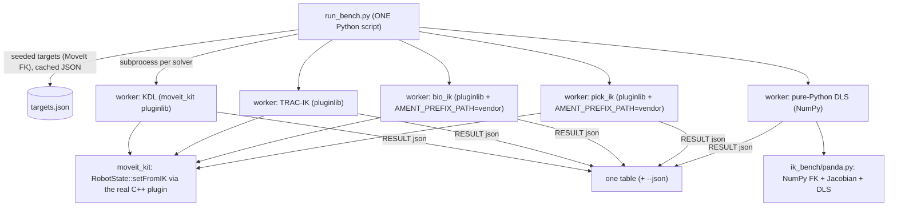

# ik_bench — benchmarking IK solvers from ONE Python script

**Date:** 2026-07-12 · **Env:** pixi `ik` (= `moveit` + `trac_ik`; robostack-jazzy +
conda-forge), `ros-jazzy-moveit 2.12.4`, `ros-jazzy-trac-ik-kinematics-plugin 2.0.2`,
bio_ik + pick_ik vendored from source, `cppyy 3.5.0`, Python 3.12, linux-64.
**Question:** some inverse-kinematics solvers ship *only* as C++ MoveIt plugins —
**bio_ik and pick_ik are not even packaged**; others are packaged (KDL, TRAC-IK).
Comparing them normally means C++ harnesses, launch files and parameter servers. Can
**one Python script** benchmark all of them — packaged and unpackaged C++ plus a pure
-Python baseline — on the same robot and targets, apples to apples?

**Verdict: YES.** cppyy + `moveit_kit` load every C++ plugin **in-process via
pluginlib** (COMMON_PATTERNS §19) and drive `RobotState::setFromIK`; the pure-Python
row is NumPy only. Five solvers, one `run_bench.py`, one table. The two unpackaged
C++ solvers are vendored-built (COMMON_PATTERNS §21) and discovered by the **same**
pluginlib-by-lookup-name path as the packaged ones — Cling never parses their headers.

(For the pitch in one paragraph see [WHY.md](WHY.md); for the pluginlib/param
mechanic these solvers load through see the [moveit_kit report](../../moveit_kit/REPORT.md).)

---

## THE TABLE (the deliverable)

MoveIt **Panda** (fixed base), **200 seeded targets** (150 reachable + 50 near-joint-
limit), per-solve **timeout 50 ms**, success verified **independently** by FK error
(position < 1 mm AND orientation < 0.57°), solve-rate = **median of 3 timed passes**,
warmup excluded. `pixi run -e ik bench-ik`.

| solver | packaging | success | near-limit | solve/s | pos err median (mm) | ori err median (°) |
|---|---|--:|--:|--:|--:|--:|
| **KDL** | packaged (MoveIt) | **98.5 %** | 47/50 | 386 | 0.0001 | 0.0000 |
| **TRAC-IK** | packaged | **98.5 %** | 47/50 | **891** | 0.0009 | 0.0001 |
| **bio_ik** | **vendored (C++-only)** | **98.5 %** | 47/50 | **999** | 0.0009 | 0.0002 |
| **pick_ik** | **vendored (C++-only)** | 97.5 % | 46/50 | 141 | 0.5519 | 0.0196 |
| **pure-Python DLS** | NumPy (no MoveIt/cppyy) | 70.5 % | 32/50 | 40 | 0.6931 | 0.0100 |

**Reading it honestly (shared machine — provisional, directional):**
- **The four C++ solvers all clear ~98 %**; the numeric Jacobian solvers (KDL, TRAC-IK,
  bio_ik) converge to **sub-micron** FK error. `reported == verified` for every solver
  — no solver claimed a success that failed the independent FK check.
- **bio_ik — an unpackaged, C++-only solver built from source — is the *fastest*** here
  (~999 solve/s), edging TRAC-IK. That is the whole point: a solver you cannot `pip`/
  `conda install` is benchmarkable, and competitive, from one Python file.
- **pick_ik is a global optimiser**: it trades raw speed (141/s) and to-threshold
  precision (~0.55 mm, at its 1 mm position threshold) for the ability to start far from
  the goal. Different regime, honestly shown — not a bug.
- **Pure-Python DLS is the honest floor**: 70.5 % (and only 32/50 near limits), ~10–25×
  slower than the C++ solvers even *with* random restarts inside the same 50 ms budget.
  This is the "before" the whole cppyy story exists to beat.

---

## How the harness works

Three files (`ik_bench/`):
- **`run_bench.py`** — orchestrator + workers. Generates the seeded target set once
  (via MoveIt FK, cached to `build/ik_bench/targets.json`), then spawns **one
  subprocess per solver** against it and collects the metrics. Subprocess isolation is
  load-bearing: cppyy and NumPy stay apart, MoveIt's process-global plugin state is a
  clean slate each time, timing is uncontended, and a **blocked solver cannot sink the
  run** (it becomes an honest `BLOCKED` row).
- **`solvers.py`** — the solver registry. Each entry is uniform: a MoveIt pluginlib
  lookup name + params, or the Python kind. Adding a solver is one record.
- **`panda.py`** — the pure-Python baseline: parses the *same* `panda.urdf` into the
  7-DOF chain and implements FK, the geometric Jacobian and damped-least-squares IK in
  NumPy. Its FK is validated against MoveIt's FK to ~1e-9 (a test), so the MoveIt-
  generated targets are measured consistently for the Python row.

**Metrics.** Per solver: verified **success %** (FK error within tolerance, *not* the
solver's own verdict — so a solver that lies about success is caught), **solve-rate**
(median of N timed passes, warmup excluded), position/orientation error median+max over
the hits, per-solve **timeout**, and a **near-limit** breakdown. `--json` writes it all.

---

## Per-solver quirks (the frictions, precisely)

Every C++ solver loads through the identical mechanic — `moveit_kit.load_kinematics_
solver(node, model, "panda_arm", plugin="<lookup name>")`, which loads the plugin via
`pluginlib::ClassLoader<kinematics::KinematicsBase>` and wires it onto the group
(moveit_kit REPORT §2). The differences are all in **configuration and packaging**:

1. **TRAC-IK — the parameter prefix.** TRAC-IK's config is a
   `generate_parameter_library` `ParamListener` whose prefix is fixed in the plugin as
   `robot_description_kinematics.<group>` (not the bare group name). So its params
   (`solve_type`, `epsilon`, …) must be flattened under
   `robot_description_kinematics.panda_arm.*`. We run **`solve_type: "Speed"`** (return
   the first valid solution) for the fair, KDL-like comparison; TRAC-IK also offers
   `Distance`/`Manipulation*` modes that run to timeout to optimise the solution (much
   lower solve-rate, higher quality) — a knob, documented, not benchmarked here.

2. **bio_ik — the floating base.** The panda test SRDF declares a **floating** virtual
   joint (`world -> panda_link0`), a MoveIt convention for mobile manipulation. bio_ik's
   own forward kinematics reads `getVariableDefaultPositions`, and a floating joint's
   default quaternion is `(0,0,0,0)` -> a degenerate base transform -> **it never
   converges** (0 % success, even starting *at* the answer; MoveIt prints "Quaternion is
   zero ... Setting to identity" each solve). Fix: build a **fixed-base** model
   (`_fixed_base_srdf`: `type="floating"` -> `type="fixed"`). Identical arm kinematics at
   the origin, so KDL/TRAC-IK/targets are unchanged; bio_ik then reaches 98.5 %. The
   harness builds every solver on this fixed-base model so the robot is identical across
   rows.

3. **pick_ik — g_p_l is a *header* wall, not a *build* wall.** pick_ik is
   `generate_parameter_library`-heavy: its generated `*_parameters.hpp` is exactly the
   header that **SIGSEGVs Cling's parser** (COMMON_PATTERNS §9). It builds and loads
   **cleanly anyway**, because we never `cppyy.include` a pick_ik header — its own CMake
   compiles the g_p_l code into `libpick_ik_plugin.so`, and pluginlib `dlopen`s the
   finished `.so`. This is the crisp proof of the boundary the moveit_kit report drew:
   the g_p_l hazard is a parse-time wall only; the compiled artifact is fine. pick_ik
   runs in `mode: "global"` (initial guess may be far from the goal).

4. **Vendored plugins — `LD_LIBRARY_PATH` must be set by the *parent*.** A vendored
   plugin `.so` depends on its sibling core lib (`libbio_ik.so`) in the same private
   prefix. The dynamic linker reads `LD_LIBRARY_PATH` **at process start**, so setting
   it inside the running worker is too late for pluginlib's `dlopen`. The orchestrator
   therefore prepends the vendored `lib/` dir to `LD_LIBRARY_PATH` (and the prefix to
   `AMENT_PREFIX_PATH`, which *is* read at runtime) in the child's environment **before
   spawning** it (`_solver_env`).

5. **pure-Python DLS — restarts for a fair budget.** A single-seed DLS descent is a
   local method that stalls in minima. To match the C++ solvers' semantics (KDL/TRAC-IK
   do random restarts within their timeout), the baseline restarts from fresh random
   configs until it converges or the 50 ms budget is spent, early-returning on success.
   It still lands at 70.5 % / 40 Hz — capable-ish but far below the C++ rows.

---

## Vendored-source build stories (COMMON_PATTERNS §21)

Both unpackaged solvers build the same way — `ik_bench/vendor/build_bio_ik.py` /
`build_pick_ik.py`: clone the maintained fork, run its **own `ament_cmake`** via a
plain `cmake` configure/build/install into a private prefix under `build/vendor/...`.
Unlike DBoW2 (a direct `$CXX` compile that avoids the library's CMake), a **pluginlib
plugin must be discoverable by the ament index**, and `ament_package()` +
`pluginlib_export_plugin_description_file` write exactly that — the
`moveit_core__pluginlib__plugin/<pkg>` marker, the plugin description XML and the
`.so`. Put the prefix on `AMENT_PREFIX_PATH` and pluginlib finds the plugin by lookup
name, no different from a packaged one.

- **bio_ik** (`PickNikRobotics/bio_ik` @ `ros2`): **built first try, no patches.** A
  clean ament_cmake package (OpenMP, no g_p_l). Its one wrinkle was the floating-base
  FK issue above, fixed at the model level, not the build.
- **pick_ik** (`PickNikRobotics/pick_ik` @ `main`): **built first try**, once the one
  header-only build dep it needs beyond MoveIt — **`range-v3`** — was added to the `ik`
  feature (fmt, rsl, tl-expected, generate_parameter_library were already present via
  MoveIt). No source patches.

Artifacts live in the gitignored `build/vendor/` tree, env-version-tagged by the pixi
toolchain; a fresh env is a clean rebuild. Builds are idempotent (`--force` rebuilds).

---

## Env / lock changes

- New pixi **`[feature.ik]`** (`ros-jazzy-trac-ik-kinematics-plugin 2.0.2` + `range-v3`)
  and **`ik` environment** = `moveit` + `ik` features (`solve-group = "default"`).
  Because the shared default solve-group is pinned, adding these re-locks it — the
  `pixi.lock` churn is the **additive** trac_ik + range-v3 trees; no existing pin moved.
- Tasks: **`bench-ik`** (the table), `build-bio-ik`, `build-pick-ik`, `test-ik`.
- bio_ik/pick_ik add **no conda dependency** — they are source builds.

---

## GAPS / honest limits

1. **Panda-only, single tip, pose goals.** One 7-DOF arm, one end-effector, full 6-DOF
   pose targets. Redundancy-resolution quality, multi-tip goals, position-only IK, and
   bio_ik/pick_ik's *custom cost-function* goals (their real differentiator) are not
   exercised — this benchmarks the common `setFromIK` path, not each solver's frontier.
2. **Solve-rate includes the Python loop + boundary crossing.** Directional, not a pure
   C++-call microbenchmark; and the machine was shared during measurement (median of
   repeats mitigates but does not erase contention). Treat absolute Hz as provisional,
   the *ranking* and success/accuracy as robust.
3. **Success is a 1 mm / 0.57° FK gate.** pick_ik's higher error is it converging to its
   *own* 1 mm threshold, not a defect; tightening the gate would drop it, not KDL/bio_ik.
4. **Vendored builds track a branch**, not a pinned commit (documented in the build
   scripts) — reproducible against the fork's current head, re-pin for archival.
5. **Seed policy.** Each target pairs a valid config's FK pose with a *different* random
   seed, so solvers must search; results depend on that seed distribution (fixed, =61).

---

## Generic lessons (candidates for COMMON_PATTERNS — for the lead)

- **A vendored MoveIt/ROS *plugin* wants its ament install layout, not a bare `.so`.**
  The DBoW2 §21 recipe (direct `$CXX` -> `.so`) does not suffice for a pluginlib plugin:
  discovery is via the **ament index**, which the package's own `ament_package()` +
  `pluginlib_export_plugin_description_file` produce. So for a plugin, "vendored build"
  = *run its CMake with a plain `cmake` into a private prefix*, then put the prefix on
  `AMENT_PREFIX_PATH`. A second §21 shape worth writing down next to DBoW2.
- **`LD_LIBRARY_PATH` for a dlopen'd plugin's sibling libs must be set before the
  process starts** — the dynamic linker caches it at startup, so a vendored plugin's
  co-installed core lib is unreachable if you set it in-process. Set it in the parent's
  child-env (or `$ORIGIN`-RPATH the install). Sharpens the §19 pluginlib recipe.
- **generate_parameter_library: confirmed a header-parse wall only.** pick_ik is the
  positive control — a g_p_l-heavy plugin builds and `dlopen`s fine; only `cppyy.
  include` of the generated header crashes. Reinforces the moveit_kit rule: load the
  plugin, never parse its params header.
- **A plugin's own FK may assume a fixed base.** bio_ik silently fails on a floating-
  virtual-joint model because its internal FK trusts `getVariableDefaultPositions`
  (zero quaternion). When driving a kinematics plugin standalone, prefer a fixed-base
  SRDF unless the plugin explicitly supports the mobile base.
- **The g_p_l kinematics-param prefix is `robot_description_kinematics.<group>`** (the
  MoveIt convention), not the bare group name — needed to *configure* any of these
  plugins from a Python-built node (KDL uses its own defaults so it hid this).
