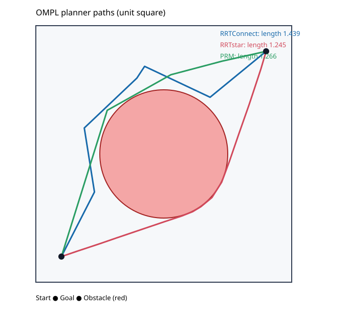

# Comparing RoboPlan and OMPL on a UR5

This tutorial compares two ways to plan a joint-space path for the same UR5,
from the same start configuration to the same goal, against the same RoboPlan
collision scene. RoboPlan is a Pinocchio-based planning library whose `Scene`
owns the robot model and collision geometry. OMPL supplies general-purpose
sampling-based planners and lets the application provide the state-validity
checker. [RoboPlan architecture](https://roboplan.readthedocs.io/en/latest/design/architecture.html)
· [OMPL state validity](https://ompl.kavrakilab.org/core/stateValidation.html)

The aim is to check whether each planner can find a path that passes the common
validity contract, and to compare observed solve time under repeated trials.
This is a focused planner comparison, not a comparison of complete robot
software stacks.

## Setup and run

Use the comparison environment and the bundled RoboPlan UR5 model selected by
the demo. Both planners receive the same arm joints, start and goal, limits,
self-collision model, world obstacle, and edge-validation step size. The scene
adds a box measuring 0.22 m on each axis, centered at `(0.35, 0, 0.55)` in
`base_link`.

```bash
pixi run -e roboplan-ompl demo-ompl-roboplan
```

The command runs `ompl_kit/demos/compare_roboplan_rrtconnect.py`.
It prints the repeated-trial results and a solve-time ranking. Keep the machine
otherwise idle for repeatability. Use your run's output for your machine.

### Local result (28 September 2026)

On an x86-64 Intel Core Ultra 9 285H with Python 3.12, RoboPlan 0.7.0,
and OMPL 1.7.0, ten fresh processes each ran five measured plans per library.
Each process also ran one unmeasured warmup plan per library. All 50 returned
paths from each library passed the shared endpoint, limit, and sampled-segment
checks. The table reports the median and range of the ten per-process medians;
the script reports the five-trial median for one invocation.

| Library | Valid paths | Median of process medians | Range of process medians |
|---|---:|---:|---:|
| RoboPlan | 50/50 | 1.19 ms | 1.18–1.29 ms |
| OMPL via `ompl_kit` | 50/50 | 1.50 ms | 1.19–3.43 ms |

RoboPlan's median was about 1.26× lower in this run. One OMPL process had a
rounded median equal to RoboPlan's, and OMPL's process-to-process spread was
larger, so the result is a modest observed difference rather than a consistent
per-run win. The selected start and goal are both valid in a baseline scene
without the added box, and their straight joint-space interpolation passes the
0.05-radian sampled edge check there but collides after the box is added. This
confirms that the box blocks the checked direct interpolation and makes the
planning problem require a detour. The timing compares OMPL's Python validity
callback with RoboPlan's C++ scene integration; it does not isolate
planner-kernel speed or predict other problems.

## Shared validity contract

RoboPlan's `Scene` exposes collision and joint-limit queries on joint vectors.
Its `SceneContext` provides the collision query with private scratch. The
OMPL callback maps each arm state into the same full UR5 joint vector:

```python
import numpy as np
from roboplan.core import SceneContext

context = SceneContext(scene)
reference = full_start.copy()  # fixed values for joints outside the arm group

def is_valid(state):
    q_arm = np.asarray([state[i] for i in range(len(q_indices))])
    q_full = reference.copy()
    q_full[q_indices] = q_arm
    return scene.isValidConfiguration(q_full) and not context.hasCollisions(q_full)
```

The OMPL kit accepts a Python validity function and pins its lifetime to the
setup object:

```python
import ompl_kit

ob, og = ompl_kit.bringup_ompl()
space = ob.RealVectorStateSpace(len(q_indices))
# Configure arm bounds and start/goal states as in the runnable demo.
ss = og.SimpleSetup(ob.StateSpacePtr(space))
ss.setStateValidityChecker(ompl_kit.validity_checker(is_valid, owner=ss))
ss.setPlanner(ob.PlannerPtr(og.RRTConnect(ss.getSpaceInformation())))
ss.setup()  # complete setup before timing solve()
```

The RoboPlan side uses its `Scene` and RRT API directly; its RRT planner calls
the scene's collision checks while exploring joint space. RoboPlan documents
the `Scene`/`JointConfiguration`/`RRT` flow in its
[sampling-based planning example](https://roboplan.readthedocs.io/en/latest/concepts/sampling_based_planning.html).

```python
from roboplan.core import JointConfiguration
from roboplan.rrt import RRT, RRTOptions

options = RRTOptions(group_name="arm", rrt_connect=True, max_planning_time=1.0)
planner = RRT(scene, options)
start = JointConfiguration(joint_names, start_arm)
goal = JointConfiguration(joint_names, goal_arm)
path = planner.plan(start, goal)
```

These excerpts show the public API shape; they are illustrative, not a copy of
the demo's full setup code. The runnable comparison script is the source of
truth for model loading, OMPL state-space setup, joint ordering, planner
options, seeding, and result validation.

## Two ways to make C++ algorithms available in Python

RoboPlan ships Python modules alongside its C++ packages. Its architecture
documents nanobind bindings and typed stubs for those packages, including the
RRT module; its source build instructions explicitly include building Python
bindings. This is a solid route when a project wants a supported Python API
with a curated surface. [RoboPlan architecture](https://roboplan.readthedocs.io/en/latest/design/architecture.html)
· [RoboPlan build instructions](https://roboplan.readthedocs.io/en/0.2.0/getting_started.html)

This OMPL example uses cppyy differently: it loads the installed OMPL library
and exposes its C++ declarations from headers at runtime. The tutorial uses
OMPL's API directly, so adding a planner does not require writing a Python
wrapper for that planner. For example, after bringing up `ompl_kit`, include
PRM's header and pass the planner to the configured `SimpleSetup` `ss` from
the earlier OMPL setup example:

```python
import cppyy
import ompl_kit

ob, og = ompl_kit.bringup_ompl()
cppyy.include("ompl/geometric/planners/prm/PRM.h")

prm = og.PRM(ss.getSpaceInformation())
ss.setPlanner(ob.PlannerPtr(prm))
```

The kit still has a small amount of OMPL-specific glue for callback signatures,
object lifetimes, and result extraction. The practical benefit is avoiding
per-algorithm wrapper authoring and build work while exploring or composing
algorithms against the installed C++ library. A maintained binding package
like RoboPlan's can invest that effort in a polished, stable Python interface.

## Optional: compare OMPL planners and edit the obstacle

The 2D sweep compares RRTConnect, RRTstar, and PRM on a unit-square problem
with a circular obstacle. It includes PRM's header at runtime, as in the
example above, and saves the validated paths as an SVG:

```bash
pixi run -e ompl demo-ompl-sweep
```

One local default run (seed 42, 1 s solve cap per planner) returned valid paths
for all three planners:

| Planner | Solve time | Path length |
|---|---:|---:|
| RRTConnect | 12.98 ms | 1.4391 |
| RRTstar | 1016.70 ms | 1.2455 |
| PRM | 49.72 ms | 1.2656 |

This is one illustrative run, not a performance benchmark. RRTstar uses its
full time cap to improve path quality, so its solve time should not be ranked
against RRTConnect or PRM.



Move or resize the obstacle from the command line and rerun the sweep to see
how the routes change:

```bash
pixi run -e ompl demo-ompl-sweep --obstacle-x 0.45 --obstacle-y 0.55 --obstacle-radius 0.20
```

Compare the returned path lengths and validity as well as the routes in the
figure.

### Optional: measure validity-check overhead

The OMPL hot-loop demo compares a Python callback, a Python checker subclass,
and a cppyy JIT C++ checker on the same separate 2D problem. Run its microbench
with:

```bash
pixi run -e ompl bench-ompl --micro-n 200000
```

In one local run, the two Python checker variants each recorded 136 validity
checks; all variants returned a path of length 1.4391. The isolated
microbenchmark measured 300.8 ns per Python
callback check, 349.2 ns per Python subclass check, and 15.4 ns per JIT C++
check, about 20× less time per check for the C++ checker than the Python
callback. Whole-solve times were 11.37, 10.64, and 8.61 ms, respectively;
these include planning work, while the microbenchmark times direct checker
calls. This is a separate 2D OMPL experiment, not a measurement of the UR5 or
RoboPlan scene.

## Reading the results

For each planner, the report should include the number of successful solves,
the number of returned paths that pass the common endpoint, limit, and
collision checks, and the median solve time over the configured trials. A path
that the planner returns but that fails the common validation is not counted
as valid. Rank solve time only among planners whose paths passed validation;
show unsuccessful or invalid results separately rather than treating them as
fast wins.

The timing covers each `solve()` or `plan()` call. It excludes model loading,
library bring-up, planner construction, explicit OMPL setup, and one warmup
solve per planner. OMPL's Python validity callback crosses Python/C++ once per
state check; RoboPlan uses its C++ scene integration. Interpret the result as
API-call time for these Python configurations.

## Equivalence limits

Sharing the UR5, collision geometry, and state-validity function controls the
main correctness inputs, but the planners still differ in implementation and
configuration. Their sampling, distance/interpolation rules, termination,
shortcutting, and planner defaults need not match. OMPL's default discrete
motion validation samples edges at a configured resolution; a coarse
resolution can miss collisions between samples. RoboPlan's edge checks also
use a step size. The example sets 0.05-radian joint-space edge checks and
validates every returned segment with the shared collision checker at that
spacing. [OMPL motion validation](https://ompl.kavrakilab.org/core/stateValidation.html)

This experiment does not establish general performance superiority, physical
robot safety, or equivalence between all features in RoboPlan and OMPL. Its
conclusion is limited to the stated UR5 model, scene, start/goal pair,
validity resolution, options, software versions, and trial protocol.
