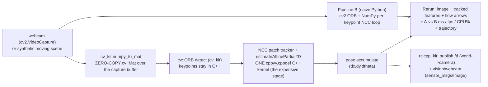

# Live webcam demo — "expensive computation, all in Python"

**Date:** 2026-07-12 · **Env:** pixi `vision` (robostack-jazzy + conda-forge),
`opencv 4.13.0` (C++ libs + headers + `cv2`), `rerun-sdk 0.34.1`, `cppyy 3.5.0`,
Python 3.12, linux-64. **Machine:** quiet laptop, `/dev/video0` (built-in webcam,
640×480 @ ~30 fps), RTX PRO 2000 Blackwell (unused here — see the CUDA note).

**The brief:** a compelling live webcam demo doing genuinely expensive computation
entirely in Python, with a robotics slant.

**What it is.** One script (`cv_kit/demos/webcam_demo.py`) runs a small **visual
odometry front-end** on the live webcam, **two ways**, over the identical frames,
side by side in Rerun with per-frame processing-time / achievable-FPS / CPU% plots:

- **Pipeline A ("all in Python", the cppyy_kit way).** camera → `cv::Mat`
  (zero-copy alias of the capture buffer via `cv_kit.numpy_to_mat`) → C++ `cv::ORB`
  keypoints (`cv_kit`) → a **hand-written per-keypoint NCC patch tracker** + a 2D
  similarity motion estimate, all inside **one `cppyy.cppdef` C++ kernel** (features,
  grayscale patches and correspondence arrays never cross back into Python) → a TF
  transform + an image topic published via `rclcpp_kit` → Rerun.
- **Pipeline B (naive Python baseline).** The *identical* algorithm written the way
  a roboticist prototypes it: `cv2.ORB` keypoints as Python objects, and the NCC
  patch tracker as a **NumPy-per-keypoint Python loop**.

**Verdict: it lands, and the numbers are honest.** On the same live frames the kit
pipeline sails at **160–230 fps** while the naive-Python one struggles at **~14 fps**
— a measured **~12–15×** — and both compute the same optical flow. The gap is *not*
magic: it is exactly the cppyy_kit thesis (COMMON_PATTERNS §6/§26 — a per-element
Python loop is the trap), and it is *dramatic here specifically because the expensive
stage is a custom kernel with no OpenCV one-liner*. Where OpenCV *does* provide the
primitive (ORB, RANSAC), A is only ~1.1–1.2× faster — and this report says so.

---

## How it fits together



The two pipelines are `VoTrackerCpp` (A) and `VoTrackerPy` (B) in the demo; the C++
kernel is `rclcppyy_webcam::VoTracker` (a `cppyy.cppdef` block that also loads
`calib3d` for `estimateAffinePartial2D`, which `cv_kit` does not load by default).

---

## The A-vs-B table

**The expensive stage (the demo default): a per-keypoint NCC patch tracker.** There
is no single `cv2` call for "NCC-search each keypoint's patch over a window and
return the refined flow", so the naive baseline must loop in Python. Synthetic moving
scene, ORB `nfeatures`, NCC over the strongest ≤150 keypoints, 7×7 patch, 11×11
search, `--bench-n 100`, quiet machine (directional, not exact):

| Resolution | tracked kps | A (cppyy_kit → C++) | B (naive Python) | A speedup |
|---|--:|---|---|--:|
| 640×480  | 140 | **4.32 ms · 231 fps · 85% CPU** | 66.3 ms · 15.1 fps · 99% CPU | **15.4×** |
| 1280×720 | 150 | **6.14 ms · 163 fps · 95% CPU** | 72.8 ms · 13.7 fps · 99% CPU | **11.9×** |

Live from the actual webcam (640×480, `--track-points 80`): A **3.0 ms/frame
(~328 fps)** vs B **39.8 ms (~25 fps)** = **13×**, 0 dropped frames, clean exit.
(CPU% is process CPU / wall — >100% when OpenCV multithreads ORB internally; the
NCC kernel and the Python loop are single-threaded, so at the plotted per-frame level
both hover near one core.)

**The honest control — library-provided ops only (ORB match + RANSAC, no NCC
stage).** When the per-frame work is *only* OpenCV C++ calls, `cv2` is C++ too, so
the difference collapses to per-frame Python orchestration/copies (directional
micro-bench):

| Resolution / features | A (cppyy_kit) | B (cv2 Python) | A speedup |
|---|---|---|--:|
| 640×480 / 1500 | 5.3 ms | 6.3 ms | 1.18× |
| 640×480 / 3000 | 7.7 ms | 8.7 ms | 1.12× |
| 1280×720 / 3000 | 10.9 ms | 11.5 ms | 1.06× |

This matches `cv_kit`'s own REPORT note ("cv2.ORB would give similar per-frame
numbers — the win is composition"). **The lesson for the stage:** the cppyy_kit win
is large exactly when you write your *own* numerical kernel (which robotics people
constantly do — custom trackers, cost functions, robust estimators) and small when
you're just chaining library primitives. This demo shows both, on the same screen.

---

## What the live view shows (stage-story self-assessment)

Left: the live camera with the tracked ORB features (green dots) and their NCC flow
vectors (yellow arrows) — you move the camera and the arrows sweep with the motion.
Right, top to bottom: **processing time ms/frame** (A green line pinned near the
bottom, B orange line 10–15× higher), **achievable FPS**, **process CPU %**, and the
**accumulated camera trajectory** (blue path) it publishes as TF. As you pan the
camera the trajectory grows; the plot divergence is immediate and unambiguous.

**Quality:** strong. The two lines are far apart and stay apart, on live imagery, and
the narrative ("you wrote both in Python; one runs as C++") is true. Caveats worth
knowing on stage: (1) with both pipelines on every frame the *loop* is bottlenecked
by B (~14 fps), so the video updates at ~14 fps — press on with `--no-baseline` to
show A alone at full frame rate, or `--track-points 60` to keep the loop snappier;
(2) the webcam here caps at 640×480 (the 1280×720 row is synthetic).

---

## Robustness (built for a live stage)

- **No camera? No problem.** `--source auto` (default) uses the webcam if it opens
  and otherwise falls back to the synthetic moving scene, printing why. `--source
  synthetic` forces it (CI/rehearsal).
- **Unplug mid-demo?** A dropped/failed read never raises; after 5 consecutive
  failures the demo switches to the synthetic scene and logs a Rerun warning, so it
  keeps running.
- **Frame 0 doesn't stutter.** `warmup()` runs both pipelines on throwaway frames
  first, moving the one-time first-use JIT of the C++ `track()` wrapper (and OpenCV
  codegen) out of the live loop.
- **Clean teardown.** The camera is released in a `finally`; `rclcpp` shuts down in
  order via `cppyy_kit` (no `os._exit`); Ctrl-C exits cleanly. Verified exit 0 across
  synthetic-headless, synthetic+ROS, and 6252-frame live runs.
- **Headless == live, minus the window.** `RCLCPPYY_RERUN_SPAWN=0` writes a `.rrd`;
  unset + a display spawns the native viewer (verified: the viewer opened a real
  X11 window and streamed). Same `vision_viz` conventions as the other demos.

---

## Run-book (what to type on stage, what can go wrong)

```bash
# 0. one-time, in the worktree/checkout:
pixi install -e vision

# 1. THE demo — live webcam if present, else synthetic; opens a Rerun window:
ROS_DOMAIN_ID=62 pixi run -e vision demo-webcam

# 2. smoother video (A alone at full rate; the plots still show B from the table):
ROS_DOMAIN_ID=62 pixi run -e vision demo-webcam --no-baseline

# 3. no camera on the podium laptop — identical story on the synthetic scene:
pixi run -e vision demo-webcam --source synthetic

# 4. crank the drama (bigger gap, B drops harder): raise the tracked-point budget
pixi run -e vision demo-webcam --track-points 250

# 5. just the numbers (no window, no ROS) for a slide:
pixi run -e vision bench-webcam
```

**What can go wrong, and the fix:**

| Symptom | Cause | Fix |
|---|---|---|
| "no webcam … using the synthetic moving scene" | camera busy / no `/dev/video*` | expected fallback; or free the camera / pick `--device N` |
| video feels laggy (~14 fps) | both pipelines run every frame (B is the bottleneck) | `--no-baseline`, or lower `--track-points` |
| no Rerun window opens | no display, or the viewer can't bind | it degrades to a `.rrd` and prints the `rerun <file>` line; force with `RCLCPPYY_RERUN_SPAWN=1` |
| `/tf` or image topic missing | another `ROS_DOMAIN_ID` | export `ROS_DOMAIN_ID=62` (the demo's default) |
| want it without ROS entirely | — | `--no-ros` |

Controls: `--source {auto,webcam,synthetic}`, `--device`, `--width/--height`,
`--duration`, `--nfeatures`, `--track-points`, `--patch-radius`, `--search-radius`,
`--min-score`, `--motion-scale`, `--no-ros`, `--no-baseline`, `--bench`.

---

## CUDA note (why there is no CUDA row)

`cv_kit` auto-detects a CUDA OpenCV build (`cv::cuda::ORB`) and pipeline A would take
it with no code change (docs: `cv_kit/CUDA_OPENCV.md`, Esri prebuilt validated on
this GPU at ~4.7×). Two honest reasons the head-to-head has no CUDA row:

1. **The single-process A-vs-B comparison is incompatible with provisioning CUDA
   OpenCV.** Pipeline B uses `cv2` (the CPU `libopencv`); pipeline A via cppyy would
   load the CUDA `libopencv`. They share every soname, and `CUDA_OPENCV.md` is
   explicit that loading both `libopencv_core` variants in one process corrupts it.
   The CUDA path is therefore an **A-only** run (`--no-baseline` in the `vision-cuda`
   env), not a same-process comparison.
2. **The expensive stage is a CPU custom kernel.** The NCC tracker (the thing that
   makes B struggle) is hand-written C++; CUDA would only accelerate the ORB
   *detect* step, a small fraction of A's ~4 ms — it wouldn't move the A-vs-B story.

So CUDA was timeboxed out as low-value-for-this-demo, with the path documented.

---

## Tests

`cv_kit/tests/test_webcam_demo.py` (in `pixi run -e vision test-vision`; auto-skips
without OpenCV/cv2/rerun, so the default suite is unaffected — a clean collect-and-
skip): A/B parity (same keypoints, ≥90% bit-identical NCC flow, motion delta <0.5px),
A>2× B on the bench path, a deadline-bounded synthetic-headless live run that writes
its `.rrd`, and the source fallback. **13 passed, 14 skipped** (the skipped ones are
the DBoW2 loop-closure suites — this demo doesn't use dbow).

---

## Gaps / lesson candidates (for the lead — not added to COMMON_PATTERNS by me)

- **The honest webcam headline: the cppyy win tracks "custom kernel vs library
  primitive", not "C++ vs Python".** For OpenCV-provided ops (ORB/match/RANSAC) A is
  ~1.1–1.2× (per-frame Python orchestration only); for a hand-written per-element
  kernel with no `cv2`/vectorized-NumPy one-liner (NCC patch track) it is ~12–15×.
  The demo's value is showing *both* on one screen so the audience sees exactly where
  cppyy_kit earns its keep. Reinforces §6/§26.
- **`cv2` and cppyy-loaded OpenCV coexist fine in one process — for the *same*
  build.** The CPU `libopencv` is loaded once (same `.so`), so pipeline A (cppyy) and
  pipeline B (`cv2`) share it with no corruption. This is the flip side of the
  CUDA same-soname hazard: the hazard is *mixing builds*, not *two loaders of one
  build*. Worth a line for anyone wanting a cppyy-vs-cv2 comparison in one process.
- **A live A-vs-B demo can't also be a CUDA demo in one process** (the soname
  conflict above). If a GPU comparison is wanted it must be A-only, or two processes.
- **`time.process_time()` deltas are a dependency-free honest per-pipeline CPU
  meter** in a single-threaded driver: bracket each pipeline call, `cpu% = 100 *
  Δcpu/Δwall` = average cores busy (naturally >100% when OpenCV parallelizes). No
  psutil needed; the attribution is clean because the calls are sequential.
