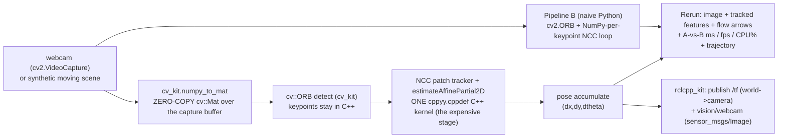

# Live webcam demo: C++ and Python pipelines

**Date:** 2026-07-12 · **Env:** pixi `vision` (robostack-jazzy + conda-forge),
`opencv 4.13.0` (C++ libs + headers + `cv2`), `rerun-sdk 0.34.1`, `cppyy 3.5.0`,
Python 3.12, linux-64. **Machine:** quiet laptop, `/dev/video0` (built-in webcam,
640×480 @ ~30 fps), RTX PRO 2000 Blackwell (not used in this run; see the CUDA note).

The script (`cv_kit/demos/webcam_demo.py`) runs two visual odometry pipelines on the
same webcam frames. Rerun shows per-frame processing time, achievable FPS, and CPU
use for both pipelines:

- **Pipeline A (Python controlled, C++ computation through cppyy).** camera → `cv::Mat`
  (zero-copy alias of the capture buffer via `cv_kit.numpy_to_mat`) → C++ `cv::ORB`
  keypoints (`cv_kit`) → an **NCC patch tracker implemented as a per-keypoint loop**, and a 2D
  similarity motion estimate, all inside one `cppyy.cppdef` C++ kernel (features,
  grayscale patches and correspondence arrays never cross back into Python) → a TF
  transform + an image topic published via `rclcpp_kit` → Rerun.
- **Pipeline B (Python and NumPy).** It uses `cv2.ORB` keypoint objects and a
  NumPy loop over keypoints for the NCC patch tracker.

On the same live frames, Pipeline A runs at **160–230 fps** and Pipeline B at
**about 14 fps**, a measured **12–15×** difference. Both implement the same optical-flow algorithm. NCC ties can produce different
results for a small number of points. Most of the speed difference comes from the
NCC tracker: A runs a custom C++ kernel, while B loops over keypoints in Python. When both pipelines
use OpenCV operations such as ORB or RANSAC, A is only about 1.1–1.2× faster.

---

## How it fits together


```mermaid
flowchart LR
  C["webcam (cv2.VideoCapture)\nor synthetic moving scene"]
  M["cv_kit.numpy_to_mat\nZERO-COPY cv::Mat over the capture buffer"]
  O["cv::ORB detect (cv_kit)\nkeypoints stay in C++"]
  N["NCC patch tracker + estimateAffinePartial2D\nONE cppyy.cppdef C++ kernel (the expensive stage)"]
  P["pose accumulate\n(dx,dy,dtheta)"]
  R["Rerun: image + tracked features + flow arrows\n+ A-vs-B ms / fps / CPU% + trajectory"]
  T["rclcpp_kit: publish /tf (world->camera)\n+ vision/webcam (sensor_msgs/Image)"]
  C --> M --> O --> N --> P --> R
  P --> T
  Bp["Pipeline B (naive Python)\ncv2.ORB + NumPy-per-keypoint NCC loop"]
  C --> Bp --> R
```

The two pipelines are `VoTrackerCpp` (A) and `VoTrackerPy` (B) in the demo; the C++
kernel is `rclcppyy_webcam::VoTracker` (a `cppyy.cppdef` block that also loads
`calib3d` for `estimateAffinePartial2D`, which `cv_kit` does not load by default).

---

## A-vs-B measurements

**Main benchmark: per-keypoint NCC patch tracking.** OpenCV has no single `cv2`
call that searches each keypoint patch over a window and returns refined flow.
Pipeline B therefore loops over keypoints in Python. Synthetic moving
scene, ORB `nfeatures`, NCC over the strongest ≤150 keypoints, 7×7 patch, 11×11
search, `--bench-n 100`, quiet machine (directional, not exact):

| Resolution | tracked kps | A (cppyy_kit → C++) | B (naive Python) | A speedup |
|---|--:|---|---|--:|
| 640×480  | 140 | **4.32 ms · 231 fps · 85% CPU** | 66.3 ms · 15.1 fps · 99% CPU | **15.4×** |
| 1280×720 | 150 | **6.14 ms · 163 fps · 95% CPU** | 72.8 ms · 13.7 fps · 99% CPU | **11.9×** |

Live from the actual webcam (640×480, `--track-points 80`): A: **3.0 ms/frame (~328 fps)**. B: **39.8 ms/frame (~25 fps)**. This is a **13×**
speedup, with 0 dropped frames and exit status 0.
(CPU% is process CPU time divided by wall time. It can exceed 100% when OpenCV runs
ORB across multiple threads. The NCC kernel and Python loop are single-threaded, so
each uses about one core.)

**Control: library operations only (ORB match + RANSAC, no NCC stage).** When the
per-frame work uses only OpenCV C++ calls, `cv2` is C++ too, so
the difference collapses to per-frame Python orchestration/copies (directional
micro-bench):

| Resolution / features | A (cppyy_kit) | B (cv2 Python) | A speedup |
|---|---|---|--:|
| 640×480 / 1500 | 5.3 ms | 6.3 ms | 1.18× |
| 640×480 / 3000 | 7.7 ms | 8.7 ms | 1.12× |
| 1280×720 / 3000 | 10.9 ms | 11.5 ms | 1.06× |

This matches the `cv_kit` report: `cv2.ORB` has similar per-frame performance. The
larger speedup occurs when a pipeline uses a custom numerical kernel, such as a
tracker, cost function, or robust estimator. The difference is smaller when both
pipelines call library operations.

---

## Live view

The left panel shows the camera image, tracked ORB features (green dots), and NCC
flow vectors (yellow arrows). The right panel shows processing time, achievable FPS,
process CPU use, and the accumulated camera trajectory published as TF. The timing
plot shows A near the bottom and B about 10–15 times higher.

The timing plots remain separated on live webcam frames. When both pipelines run
on every frame, Pipeline B limits updates to about 14 fps. Use `--no-baseline` to run
A alone at full frame rate, or `--track-points 60` to reduce the work. This webcam
supports only 640×480; the 1280×720 result uses synthetic frames.

---

## Camera and viewer behavior

- **No camera:** `--source auto` (default) uses the webcam if it opens
  and switches to the synthetic moving scene if it cannot open. `--source
  synthetic` selects the synthetic scene.
- **Camera disconnect:** A dropped/failed read never raises; after 5 consecutive
  failures the demo switches to the synthetic scene and logs a Rerun warning, so it
  keeps running.
- **Startup:** `warmup()` runs both pipelines on throwaway frames
  first, moving the one-time first-use JIT of the C++ `track()` wrapper (and OpenCV
  codegen) out of the live loop.
- **Shutdown:** The camera is released in a `finally`; `rclcpp` shuts down in
  order via `cppyy_kit` (no `os._exit`); Ctrl-C exits cleanly. Verified exit 0 across
  synthetic-headless, synthetic+ROS, and 6252-frame live runs.
- **Headless mode:** `RCLCPPYY_RERUN_SPAWN=0` writes a `.rrd`;
  unset + a display spawns the native viewer (verified: the viewer opened a real
  X11 window and streamed). Same `vision_viz` conventions as the other demos.

---

## Commands and troubleshooting

```bash
# Install the environment once from the repository checkout:
pixi install -e vision

# 1. Run with the webcam if present, otherwise use synthetic frames:
ROS_DOMAIN_ID=62 pixi run -e vision demo-webcam

# Run Pipeline A alone at full rate:
ROS_DOMAIN_ID=62 pixi run -e vision demo-webcam --no-baseline

# 3. Force synthetic frames when no camera is available:
pixi run -e vision demo-webcam --source synthetic

# 4. Increase the number of tracked points:
pixi run -e vision demo-webcam --track-points 250

# 5. Print benchmark results without a window or ROS:
pixi run -e vision bench-webcam
```

**Troubleshooting:**

| Symptom | Cause | Fix |
|---|---|---|
| "no webcam … using the synthetic moving scene" | camera busy / no `/dev/video*` | expected fallback; or free the camera / pick `--device N` |
| video feels laggy (~14 fps) | both pipelines run every frame (B is the bottleneck) | `--no-baseline`, or lower `--track-points` |
| no Rerun window opens | no display, or the viewer can't bind | it degrades to a `.rrd` and prints the `rerun <file>` line; force with `RCLCPPYY_RERUN_SPAWN=1` |
| `/tf` or image topic missing | another `ROS_DOMAIN_ID` | export `ROS_DOMAIN_ID=62` (the demo's default) |

Controls: `--source {auto,webcam,synthetic}`, `--device`, `--width/--height`,
`--duration`, `--nfeatures`, `--track-points`, `--patch-radius`, `--search-radius`,
`--min-score`, `--motion-scale`, `--no-ros`, `--no-baseline`, `--bench`.

---

## CUDA note

`cv_kit` automatically uses `cv::cuda::ORB` when a CUDA OpenCV build is available.
The Esri package was validated on this GPU at about 4.7× the CPU ORB rate. See
[`CUDA_OPENCV.md`](../../cv_kit/CUDA_OPENCV.md). The head-to-head has no CUDA result for two reasons:

1. **The single-process A-vs-B comparison is incompatible with provisioning CUDA
   OpenCV.** Pipeline B uses `cv2` (the CPU `libopencv`); pipeline A via cppyy would
   load the CUDA `libopencv`. They share every soname, and `CUDA_OPENCV.md` is
   explicit that loading both `libopencv_core` variants in one process corrupts it.
   The CUDA path is therefore an **A-only** run (`--no-baseline` in the `vision-cuda`
   env), not a same-process comparison.
2. **The NCC tracker is a CPU custom kernel.** It is implemented in C++; CUDA would only accelerate the ORB
   *detect* step, a small fraction of A's ~4 ms, so it would have little effect on
   the A-vs-B result.

For these reasons, this report does not compare CUDA and CPU in one process. The
CUDA-only run is documented above.

---

## Tests

`pixi run -e vision test-vision` runs `cv_kit/tests/test_webcam_demo.py`. The tests
skip if OpenCV, cv2, or Rerun is unavailable. They check keypoint agreement, at least
90% bit-identical NCC flow, a motion difference below 0.5 px, A/B bench speed, a
headless live run that writes an `.rrd`, and automatic source fallback. The recorded
run had 13 passed and 14 skipped; the skipped tests were the DBoW2 loop-closure tests.

---

## Notes

- The measured speedup depends on the operation. For OpenCV operations such as
  ORB, matching, and RANSAC, Pipeline A is about 1.1–1.2× faster. For the custom
  NCC tracker, it is about 12–15× faster. See COMMON_PATTERNS §6/§26.
- `cv2` and cppyy can load the same CPU OpenCV build in one process. Do not load
  two OpenCV builds with the same sonames in one process. See
  [`CUDA_OPENCV.md`](../../cv_kit/CUDA_OPENCV.md).
- A live A-vs-B comparison cannot use CUDA OpenCV in the same process because
  Pipeline B uses CPU OpenCV through `cv2`, while Pipeline A would load the CUDA
  build. To compare CUDA, run Pipeline A alone or use separate processes.
- `time.process_time()` measures CPU time for the process. In this driver, pipeline calls run sequentially, so each measurement belongs to one
  pipeline. `100 * Δcpu / Δwall` reports average CPU cores in use and can exceed
  100% when OpenCV uses multiple threads. This measurement does not need psutil.
