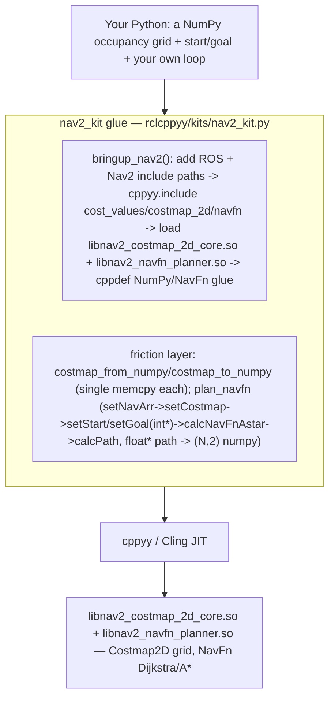

# nav2_kit spike — composing your own Nav stack from Nav2's algorithm cores in Python via cppyy

**Date:** 2026-07-11 (M6d lifecycle unlock: 2026-07-12) · **Env:** pixi `nav2`
(robostack-jazzy + conda-forge), `ros-jazzy-nav2-costmap-2d`,
`ros-jazzy-nav2-navfn-planner`, `ros-jazzy-nav2-smac-planner`,
`ros-jazzy-nav2-regulated-pure-pursuit-controller`, `ros-jazzy-nav2-msgs`,
`cppyy 3.5.0`, Python 3.12.13, linux-64. ROS_DOMAIN_ID=59.
**Question:** Nav2's Python story is client-side only (`nav2_simple_commander` sends
goals to the C++ lifecycle servers; every algorithm is a C++ class behind
pluginlib). Can we instead build *our own* nav stack by driving Nav2's **algorithm
cores directly** from Python, with Python owning the loop and C++ owning the math?

**Verdict: YES — and, since M6d, the lifecycle-coupled cores too. GO.**
`nav2_costmap_2d::Costmap2D` (a plain grid class, no node) and
`nav2_navfn_planner::NavFn` (the pure planner algorithm on a costmap char array, no
node) are driven end to end from Python against the installed Nav2 — **no lifecycle
servers, no pluginlib, no tf** — and composed into a complete miniature nav stack:
synthetic world → costmap → plan → follow loop → live `OccupancyGrid` + `Path` +
`TwistStamped` on real ROS 2 topics via rclcppyy.

**M6d — the lifecycle unlock.** The original boundary ("Smac and the RPP controller
are lifecycle-coupled and NOT usable standalone", §Probe D/F) is **retired for the two
prizes**. Constructing a real `rclcpp_lifecycle::LifecycleNode` in-process from Python
(the same move control_kit made for `ControllerManager`) is the key that fits every
lifecycle-coupled ctor. With it: **Smac 2D** (`AStarAlgorithm<Node2D>`) plans from
Python (§Probe D now **WORKS**), and the **real RegulatedPurePursuit controller**
configures + computes velocity commands from Python (§Probe F now **WORKS**). The d02
showcase gains `--planner smac` and `--controller rpp`; its follow controller is no
longer forced to be Python pure-pursuit — Nav2's actual RPP drives the robot to the
goal. Hybrid-A\* (SE(2)) stays a **flaky partial** (§Probe D2): it parses/constructs
and once planned a valid Dubins path, but its OMPL-backed distance heuristic segfaults
non-deterministically under Cling — not shipped. Mechanics are in §9 (a
COMMON_PATTERNS candidate).

(For motivation and a stock-Nav2-vs-ours side-by-side, see [WHY.md](WHY.md); for the
API and copy-paste patterns, see [SKILL.md](SKILL.md).)

---

## How the kit works



Bringup locates the install, JIT-includes the cost-value / costmap / navfn headers,
and loads the two `.so` so calls resolve. Nav2's own classes are used **directly** on
the returned `nav2_costmap_2d` / `nav2_navfn_planner` namespaces
(`Costmap2D(...)`, `NavFn(...)`). The friction layer is small and targeted: a
single-`memcpy` NumPy↔charmap bridge (§Probe B), and one helper that wraps NavFn's
real call sequence and its raw-pointer I/O (§Probe C/E).

**The same recipe as bt_kit / pcl_kit / ompl_kit.** Every kit is three moves: **(1)
bringup** — locate the install, `cppyy.include` its headers, `cppyy.load_library` its
`.so`; **(2) hide the cppyy sharp edges** — here, the bulk-buffer memcpy, NavFn's
`int*` start/goal and `float*` path arrays, and the `unsigned char`-as-`str` gotcha;
**(3) mirror the library's own API** so existing Nav2 knowledge transfers 1:1.
nav2_kit is **~88 lines of Python + 38 lines of embedded C++ glue** (281 with
docstrings).

---

## 1. Possible at all? — capability probe matrix

Each capability was probed in isolation from the `nav2` env against the installed
Nav2. Scratch probes and their output are the evidence behind each row.

| # | Capability | Result | Evidence |
|---|---|:--:|---|
| A | **Bringup + JIT**: include cost_values/costmap_2d/navfn headers, load the 2 `.so` | **WORKS** | Warm bringup **~70 ms** (costmap headers ~57 ms dominant — they pull `geometry_msgs`/`nav_msgs`; navfn header ~1 ms; loading both libs ~10 ms). `probe_cppdef` of the C++ glue returns **OK** once given the full ROS include-path set (see §Gotchas). First-ever run rebuilds the cppyy std PCH (~a minute, once/machine). |
| B | **Costmap2D from Python** + bulk NumPy→charmap load | **WORKS** | `Costmap2D(w, h, res, ox, oy, default)` is a plain class (no node); `getCharMap()` exposes the `unsigned char*` grid. A `(H,W)` uint8 array crosses in a **single `std::memcpy`**. See the crossing table below. |
| C | **NavFn plan** on that costmap (no node!) | **WORKS** | `NavFn(nx, ny)` → `setNavArr` → `setCostmap(charmap, isROS=True, allow_unknown)` → `setStart/setGoal(int*)` → `calcNavFnAstar(cancel)` → `calcPath`. Plans a 100×100 world through a doorway in **~8 ms**; 1024×1024 in **~5–23 ms** (§bench). |
| D | **Smac 2D core** (`AStarAlgorithm<Node2D>`) | **WORKS (M6d)** | Both original couplings dissolve once a `LifecycleNode` can be built from Python (§9). `a_star.hpp` JIT-parses with `include/ompl-1.7` + `include/eigen3` on the path — **OMPL *is* in the nav2 env** (shipped by `nav2-smac-planner`'s deps; the original probe missed it). `GridCollisionChecker` is built from a **NULL `Costmap2DROS` + a real `LifecycleNode`**, then the plain costmap is set via the base `FootprintCollisionChecker::setCostmap(Costmap2D*)` (the commented-out plain ctor is unnecessary). 100×100 through-doorway plan verified: 61 waypoints, 0 on lethal cells, start..goal order (Smac plans goal→start; the kit reverses). |
| D2 | **Smac Hybrid-A\*** (`AStarAlgorithm<NodeHybrid>`) | **FLAKY PARTIAL** | Parses, constructs (needs a **real** `Costmap2DROS` + `libompl` loaded + `setFootprint`), and once produced a valid **48-point Dubins path**. But `NodeHybrid::precomputeDistanceHeuristic` (the OMPL Dubins/Reeds-Shepp distance-table precompute, from `initialize`) **segfaults ~2 of 3 runs** under Cling; `OMP_NUM_THREADS=1` does not stabilize it. 2D is solid precisely because `Node2D`'s search never enters OMPL at runtime. Not shipped. |
| E | **getPath extraction** to NumPy | **WORKS** | NavFn: `getPathLen()` + `getPathX()`/`getPathY()` (`float*`) → one `memcpy` into `(N,2)` float32. Smac: `createPath` fills a `std::vector<Node2D::Coordinates>`, copied out (reversed) in a `cppdef` helper. |
| F | **RegulatedPurePursuit** | **WORKS (M6d)** | The **whole controller runs from Python.** `configure(LifecycleNode::WeakPtr, name, tf2_ros::Buffer, Costmap2DROS)` succeeds against an in-process plugin-free `Costmap2DROS` (§Probe C2) + a C++-built `tf2_ros::Buffer` fed one `map→base_link` transform + our `LifecycleNode`; `activate()` + `computeVelocityCommands(pose, vel, goal_checker)` returns sensible twists (straight line → v=0.5 w=0; offset+rotated → steers back). Two gotchas fenced: `goal_checker` is dereferenced even though the header comments its name (a **C++ `GoalChecker` stub** supplies it), and the forward collision check false-positives on a static map (disable it, or catch `NoValidControl`). Its header-only regulation math (`heuristics::curvatureConstraint`) is *also* separable, now a footnote. |

| # | Capability (M6d additions) | Result | Evidence |
|---|---|:--:|---|
| C2 | **In-process `Costmap2DROS`** (no plugins) | **WORKS** | `make_shared<Costmap2DROS>(NodeOptions with parameter_overrides)` + `configure()` → a blank fillable master `Costmap2D` (numpy memcpy fill+readback exact). Uses the `NodeOptions` ctor (names the node `costmap`, `is_lifecycle_follower_=false`); **auto-declare must be OFF** (Costmap2DROS declares its own params — auto-declare double-declares). `plugins: []` → no static map / tf / sensor pipeline. |
| L | **In-process `rclcpp_lifecycle::LifecycleNode`** | **WORKS** | `lifecycle_node.hpp` JIT-parses clean; `make_shared<LifecycleNode>(name, ns, NodeOptions)` + `configure()`/`activate()` walk UNCONFIGURED→INACTIVE→ACTIVE; `get_clock()`/`get_logger()` live. The key for every lifecycle-coupled ctor. |

**Original split holds and grows: Costmap2D + NavFn are pure cores; the M6d
LifecycleNode key adds Smac 2D, a plugin-free Costmap2DROS, and the real RPP
controller. Only Hybrid-A\* remains walled (an OMPL-under-Cling instability, not a
lifecycle coupling).**

---

## 2. The headline — a pure algorithm core vs a lifecycle-coupled plugin

The whole thesis turns on one distinction, and Nav2 has clean examples of both sides:

**NavFn is a pure algorithm** — `class NavFn { NavFn(int nx, int ny); void
setCostmap(const COSTTYPE* cmap, bool isROS, bool allow_unknown); bool
calcNavFnAstar(std::function<bool()>); int calcPath(int); float* getPathX(); ... }`.
No node, no tf, no pluginlib — it takes a raw `unsigned char*` cost array and hands
back `float*` path arrays. That is *directly* drivable from Python, and the Nav2
`NavfnPlanner` lifecycle node is just a thin ROS wrapper around exactly these calls.
nav2_kit reproduces the wrapper's call sequence in Python.

**Smac's A\* and RPP's controller are lifecycle-coupled** — and (M6d) that is no
longer a wall. `GridCollisionChecker`'s only exposed constructor takes a `Costmap2DROS`
+ a `LifecycleNode`; `RegulatedPurePursuitController::configure` takes a
`LifecycleNode::WeakPtr` + a `Costmap2DROS` + a `tf2_ros::Buffer`. The original report
concluded "none of these can be constructed without re-introducing the lifecycle
machinery the thesis avoids." **That conclusion was too strong on two counts:**

1. **A `LifecycleNode` is not "machinery" — it is a plain(ish) class you construct from
   Python** (§9), exactly like the `rclcpp::Node` we already build with parameter
   overrides. "No lifecycle *servers*" (no `planner_server`/lifecycle-manager/YAML/
   action interface) still holds; you just build the *node object* the ctors ask for.
2. **`Costmap2DROS` can run plugin-free in-process** (§Probe C2) — a real ROS costmap
   wrapper with no static map, no tf tree, no sensor layers, whose master grid you fill
   from NumPy. And for **Smac 2D** you do not even need it: a NULL `Costmap2DROS` + the
   base `setCostmap()` gives the collision checker your plain grid.

So the refined boundary is: **"drive the pure core" (Costmap2D, NavFn) needs nothing;
"drive the lifecycle-coupled core" (Smac 2D, RPP) needs the LifecycleNode key + a
plugin-free Costmap2DROS — both in-process, still no servers.** Only Hybrid-A\* remains
out, and for a *different* reason (an OMPL-under-Cling runtime crash, not a ctor
coupling).

**The kit-authoring heuristic, updated:** grep the ctor / `configure` signatures. Plain
data (`Costmap2D(w,h,...)`, `NavFn(nx,ny)`) → drive directly. A `LifecycleNode` / `*ROS`
/ pluginlib base → still reachable, via the §9 in-process lifecycle bootstrap (the
control_kit / moveit_kit move), *not* a server. The remaining walls are runtime
(missing/unstable transitive libs), not signatures.

---

## 3. The NumPy ↔ costmap crossing (the bulk-data lesson, third instance)

`Costmap2D::getCharMap()` returns the raw `unsigned char*` grid — a plain
`size_x*size_y` byte buffer with the same row-major layout as a `(H,W)` NumPy array.
So loading a grid is a single `std::memcpy` addressed via `uintptr_t` in a `cppdef`
helper — the same pattern as pcl_kit's cloud copy and bt_kit's PortsList. The naive
alternative, a per-cell `costmap.setCost(mx, my, v)` loop from Python, is
~130 ns/cell.

Measured (steady-state, after `warmup()`; shared machine — directional):

| N | cells | bulk `memcpy` | per-cell `setCost` Python loop | speedup |
|---|--:|--:|--:|--:|
| 512 | 262 144 | **~0.05 ms** | ~30.8 ms | **~600×** |
| 1024 | 1 048 576 | **~0.035 ms** | ~125.4 ms | **~3600×** |

(The 256×256 bulk figure is noisy — the first *large* costmap allocation after warmup
still pays a one-time page-fault/alloc cost; the 512/1024 rows are the clean
steady-state memcpy, which is header-size-independent as expected.) `costmap_to_numpy`
is the symmetric `memcpy` out.

---

## 4. Bench — NavFn (C++) vs a pure-Python A\* (the orchestration story)

The same plan on `N×N` **serpentine-maze** worlds (horizontal walls with alternating
gaps, so the straight-line heuristic is badly misled and A\* must expand a large
fraction of the free cells — a *real* search workload; a simple wall+doorway lets the
heuristic walk straight to the goal, which measures nothing). `NavFn` is Nav2's real
C++ planner driven via nav2_kit; `py-A*` is a plain pure-Python 8-connected A\* (NumPy
grid + `heapq`) written in `bench_nav2_plan.py` and labeled as such. **Shared machine
during measurement — directional, not exact.**

| N | cells | NavFn C++ ms | py-A\* ms | py-A\* expansions | NavFn speedup |
|---|--:|--:|--:|--:|--:|
| 256 | 65 536 | ~15 | ~96 | 52 817 | ~6× |
| 512 | 262 144 | ~5.4 | ~435 | 224 370 | **~80×** |
| 1024 | 1 048 576 | ~23 | ~1913 | 915 520 | **~82×** |

They are *different algorithms* (NavFn builds a full Dijkstra/A\* potential field; the
baseline is goal-directed A\*), so this is an order-of-magnitude story, not an
apples-to-apples race: keeping the search loop in Python costs ~1.9 s on a 1024²
grid, while handing the grid to the compiled core stays in the tens of milliseconds.
The 256 row is dominated by NavFn first-use residue on the shared machine; the 512/1024
rows are the clean signal. Run it: `pixi run -e nav2 bench-nav2-plan`.

---

## 5. The showcase — a complete miniature nav stack in one file

`scripts/nav2_kit_demos/d02_own_nav_stack.py` (`pixi run -e nav2 demo-nav2-stack`) is
the thesis made concrete:

- **World → costmap → plan (C++):** a 120×120 "two rooms + doorway + box obstacle"
  world → `Costmap2D` → `NavFn` plan (166 waypoints, through the doorway around the
  box).
- **Planner (C++):** `--planner navfn` (default) or `--planner smac` (Smac 2D, M6d) —
  both real Nav2 C++.
- **Controller:** `--controller pursuit` (default, the ~30-line Python pure-pursuit) or
  **`--controller rpp`** (M6d) — Nav2's **real RegulatedPurePursuitController** drives
  the robot. The "controller half is Python because RPP is lifecycle-coupled" caveat is
  **retired**; the Python pure-pursuit is now a *choice*, not a limitation.
- **Publish via rclcppyy:** real C++ `nav_msgs/OccupancyGrid`, `nav_msgs/Path`, and
  `geometry_msgs/TwistStamped` on live ROS 2 topics (`/nav2_kit/{map,plan,cmd_vel}`),
  so an rviz2 (Fixed Frame `map`) shows the map, plan, and commanded velocity live.

**Verified — all four planner×controller combinations reach the goal (exit 0):**
```
navfn + pursuit : Planned 166 waypoints ... (NavFn, C++). GOAL REACHED in 142 steps (~7.1s sim).
smac  + rpp     : Planned  83 waypoints ... (Smac 2D, C++). Following with RegulatedPurePursuit, C++.
                  GOAL REACHED at (4.94,1.81) in 160 steps (~8.0s sim).
smac  + pursuit : GOAL REACHED at (4.95,1.81) in 144 steps (~7.2s sim).
navfn + rpp     : GOAL REACHED at (4.93,1.80) in 167 steps (~8.3s sim).
```
(RPP notes surfaced by the *real* controller: its forward collision check
false-positives on a static map with a narrow doorway — the plan is already
collision-free, so the demo sets `use_collision_detection:false` and catches
`NoValidControl`; and near the goal RPP enters rotate-to-heading, so the demo disables
it + tightens the goal tolerance to drive straight in. These are honest RPP behaviors,
documented in the file.)

---

## 6. GAPS — what this is NOT, and what an LLM-agent user hits next

**This is the algorithm-core road (now incl. in-process lifecycle objects), not a Nav2
stack.** Explicitly absent:

1. **No lifecycle *servers*.** No `planner_server`/`controller_server`/`bt_navigator`,
   no lifecycle *manager*, no parameter YAML, no action interface. (M6d: we do
   construct the individual `LifecycleNode`/`Costmap2DROS` *objects* the coupled ctors
   ask for — in-process, driven by Python — but there is still no server bringup.)
2. **No pluginlib for the planner/controller.** Smac/RPP are constructed as concrete
   C++ classes, not loaded by name via pluginlib (that is the §19 bootstrap / the
   complementary spike, item 9).
3. **Minimal tf.** No `map→odom→base_link` transform tree, no localization; RPP is fed
   a single `map→base_link` transform set from the robot pose each step (enough for its
   plan transform).
4. **No dynamic costmap layers.** The in-process `Costmap2DROS` runs **plugin-free** —
   no `StaticLayer`/`ObstacleLayer`/`InflationLayer`/`VoxelLayer`, no sensor
   `observation_buffer`; you fill its master grid from NumPy. (An `InflationLayer`-core
   probe is still open.)
5. **No recovery behaviors / behavior trees** (that is bt_kit's territory).
6. **Smac Hybrid-A\* / Lattice not surfaced.** Hybrid-A\* is a **flaky partial**
   (§Probe D2: OMPL distance-heuristic segfaults under Cling); Lattice unprobed. Smac
   **2D** *is* surfaced and solid.
7. **RPP collision-avoidance caveat.** The real RPP controller works (§Probe F), but
   its forward collision check false-positives on a static costmap with a narrow gap
   (the demo disables it); a real dynamic-obstacle costmap would want it on.
8. **NavFn + Smac 2D only.** Other global planners (Theta\*, etc.) and the costmap's own
   `setConvexPolygonCost`/`convexFillCells` rasterizers are one `cppyy.include`/call
   away but not wrapped.
9. **The other direction is a separate planned spike.** Putting a **Python planner /
   controller plugin *inside* a real Nav2 server** (via a pluginlib bridge, à la the
   `control_kit` idea) is the complementary capability and is explicitly *not* this
   spike — this is "our own stack from the cores out", not "Python inside Nav2".

---

## 7. Generic lessons for cppyy_kit (candidates for COMMON_PATTERNS)

These generalized beyond Nav2. **Noted here for the lead — COMMON_PATTERNS.md was being
edited in parallel, so this report does not touch it.**

- **NEW: `unsigned char` crosses cppyy as a 1-char Python `str`, not an int.**
  `Costmap2D::getCost()` and the `static constexpr unsigned char` cost constants
  (`LETHAL_OBSTACLE` = 254, …) come back as length-1 strings — `'\xfe' == 254` is
  `False`, a silent trap in any comparison/threshold. Read a single cell with
  `ord(costmap.getCost(mx, my))`, and a kit should expose **plain-int** constants
  (nav2_kit does). This is the mirror image of §11 ("enums compare equal to ints") —
  worth its own sentence.
- **A failed `cppyy.include` contaminates the interpreter, not just a failed
  `cppdef` (extend §9).** When Smac's `a_star.hpp` failed mid-parse (missing OMPL
  transitive header), the *next, unrelated* `cppyy.include` of the RPP header also
  failed spuriously (a `std::common_type<double>` chrono error) in the same process —
  but that RPP header includes **cleanly in a fresh process**. Lesson: probe a *risky
  include* (one with heavy/uncertain transitive deps) out-of-process / in isolation,
  exactly as `probe_cppdef` does for `cppdef`. §9 currently frames this only around
  `cppdef`.
- **`probe_cppdef` must be given the *same* include-path set as the in-process
  bringup.** A header that transitively pulls the ROS message tree
  (`costmap_2d.hpp` → `geometry_msgs`/`nav_msgs`) makes the out-of-process probe fail
  on a *missing transitive header* (a false negative) unless every ament include dir
  is passed — not just the target library's. Worth a sentence in the §9
  `probe_cppdef` note (collect them via `get_packages_with_prefixes`).
- **Third instance of the bulk-buffer memcpy lesson (§6).** After bt's parallel
  `vector<string>` and pcl's point-cloud memcpy, Nav2's `unsigned char*` costmap is a
  third confirmation: expose the raw buffer address as `uintptr_t`, `memcpy` in a
  `cppdef` helper, ~600–3600× a per-element Python loop.
- **Output-by-pointer-array is another "keep it in C++" case (§6).** NavFn's
  `setStart/setGoal(int*)` and `getPathX()/getPathY()` (`float*` + separate length)
  are cleanest wrapped in one `cppdef` helper that takes ints and `memcpy`s the output
  arrays, rather than marshalling C arrays across the boundary from Python.
- **Kit-authoring heuristic: grep ctor/`configure` signatures for lifecycle coupling
  first (§2).** "Drivable core" vs "needs a node" is decided by whether the class
  takes plain data or a `LifecycleNode`/`*ROS`/pluginlib base. A one-line `nm -DC` /
  header grep up front tells you which targets are separable before you invest —
  **but (M6d) "needs a node" is now a build-it recipe (§9), not a wall.**
- **M6d — construct a `rclcpp_lifecycle::LifecycleNode` in-process from Python.** A
  strong COMMON_PATTERNS candidate (§9): the LifecycleNode is a plain class you
  `make_shared` with `NodeOptions` + parameter_overrides, then walk through
  `configure()`/`activate()`. It is the key that fits every lifecycle-coupled ctor in
  the ROS 2 ecosystem — the third instance of the "in-process ROS 2 node/manager"
  pattern after moveit_kit's parameterized `Node` and control_kit's `ControllerManager`.
- **M6d — `NodeOptions` auto-declare is a trap for self-declaring nodes.**
  `automatically_declare_parameters_from_overrides(True)` is right for a plain
  LifecycleNode (it makes your overrides real params) but **wrong for `Costmap2DROS`**
  (and any node that calls `declare_parameter` itself) — it double-declares and throws
  `ParameterAlreadyDeclaredException`. Rule: auto-declare only for nodes that declare
  nothing themselves; otherwise pass overrides *without* auto-declare and let the node's
  own `declare_parameter(name, default)` pick them up.
- **M6d — "the header comments the parameter name" ≠ "the parameter is unused".**
  RPP's `computeVelocityCommands(..., nav2_core::GoalChecker * /*goal_checker*/)` reads
  as unused, but the *definition* dereferences `goal_checker->getTolerances()` → a null
  crashes. When a coupled API takes an interface pointer, supply a **minimal C++ stub
  subclass** (a `cppdef` `struct : Base`) rather than `nullptr`, even if the signature
  suggests it is ignored. Check the `.so`, not just the header.
- **M6d — a "lifecycle coupling" wall and a "runtime library" wall are different.**
  Smac 2D fell to the LifecycleNode key; Hybrid-A\* did *not*, because its wall is a
  **non-deterministic OMPL-under-Cling segfault** in `precomputeDistanceHeuristic`, not
  a ctor signature. Node2D is stable precisely because its search never enters OMPL at
  runtime (a_star.hpp only *parses* the OMPL includes). Lesson: separate "can I
  construct it" from "does its runtime path enter a fragile transitive dependency"; the
  latter is where an otherwise-parseable core can still be unshippable.

---

## 8. Recommendation — GO

The hypothesis holds, and M6d widens it. **Nav2's Costmap2D and NavFn are driven end to
end from Python** with no lifecycle servers, no pluginlib, no tf; and **Smac 2D + the
real RegulatedPurePursuit controller** — the two cores the first pass marked
lifecycle-BLOCKED — now also run from Python, unlocked by constructing a real
`rclcpp_lifecycle::LifecycleNode` (+ a plugin-free `Costmap2DROS`) in-process. All four
planner×controller combinations of the miniature stack reach the goal live to rviz. The
boundary is still drawn honestly: Hybrid-A\* is a documented flaky partial (an
OMPL-under-Cling runtime crash, not a coupling), and the *reverse* direction — Python
plugins loaded by name inside real Nav2 servers — remains a separate planned spike.
nav2_kit stays a thin mirror: the M6d surface (lifecycle_node / costmap_ros /
smac_plan_2d / RPPController) adds the specific frictions and nothing else.

**Next investments, in priority order:** (a) stabilize **Hybrid-A\*** (the OMPL
`precomputeDistanceHeuristic` crash — try an isolated OMPL warmup, or lower that step to
a pre-built `.so`); (b) a costmap **InflationLayer**-core probe (inflate obstacles from
Python); (c) drive RPP with `use_collision_detection:true` against a real
dynamic-obstacle costmap; (d) surface another global planner (Theta\*); (e) the
complementary **pluginlib-bridge** spike (load a Python planner/controller *inside* a
real Nav2 server — §19 in-process pluginlib now has the LifecycleNode key it needs).

---

## 9. The M6d lifecycle unlock — mechanics (COMMON_PATTERNS candidate)

The whole unlock is one capability: **build the lifecycle objects the coupled ctors ask
for, in-process, from Python** — no servers. This is the same family as moveit_kit's
parameterized `Node` and control_kit's `ControllerManager` (COMMON_PATTERNS §19); Nav2
is the third instance and the cleanest statement of it.

### 9.1 Construct a `rclcpp_lifecycle::LifecycleNode` (the key)
```python
opts = cppyy.gbl.rclcpp.NodeOptions()
opts.automatically_declare_parameters_from_overrides(True)   # plain node: overrides->params
opts.parameter_overrides(vec_of_rclcpp_Parameter)
node = std.make_shared["rclcpp_lifecycle::LifecycleNode"](std.string(name), std.string(ns), opts)
node.configure()      # UNCONFIGURED -> INACTIVE  (runs on_configure; default = SUCCESS)
node.activate()       # INACTIVE     -> ACTIVE
```
- `lifecycle_node.hpp` **JIT-parses cleanly** (no generate_parameter_library wall, like
  ros2_control and unlike MoveIt's convenience headers).
- The node is a plain `make_shared`; the transitions are real (verified via
  `get_current_state().label()` walking `unconfigured→inactive→active`).
- `get_clock()` / `get_logger()` are live immediately — this is all Smac's collision
  checker needs from a "node".
- **Params:** flatten a dict to `std::vector<rclcpp::Parameter>` (the same
  `_parameter_value` shape as control_kit); enable auto-declare **only** for a node that
  declares nothing itself.

### 9.2 A plugin-free `Costmap2DROS` in-process
```python
opts = NodeOptions(); opts.parameter_overrides(overrides)     # NO auto-declare!
cm_ros = std.make_shared["nav2_costmap_2d::Costmap2DROS"](opts)
cm_ros.configure()          # builds the master Costmap2D (plugins:[] -> blank grid)
memcpy(cm_ros.getCostmap().getCharMap(), numpy_grid)          # fill it yourself
```
- The **`NodeOptions` ctor** names the node `costmap` and sets `is_lifecycle_follower_ =
  false` (a standalone node you drive), which is exactly what we want.
- **Auto-declare OFF** (§7): Costmap2DROS calls `declare_parameter` itself; auto-declare
  double-declares → `ParameterAlreadyDeclaredException`. Its `declare_parameter(name,
  default)` reads your overrides regardless.
- Key overrides: `plugins: []`, `filters: []`, `rolling_window: false`, `width`/`height`
  (meters, int), `resolution`, `robot_radius`, `global_frame`, `robot_base_frame`.
- **Do NOT `activate()`** it unless you want the map-update thread (unnecessary with no
  plugins; leaving it configured-only keeps your NumPy fill intact and avoids a thread).

### 9.3 Smac 2D — the NULL-Costmap2DROS collision checker
`GridCollisionChecker(costmap_ros, num_quantizations, node)` is built in a `cppdef`
helper with a **default-constructed (null) `shared_ptr<Costmap2DROS>`** and a real
`LifecycleNode`; then `checker->setCostmap(plain_costmap)` (the base
`FootprintCollisionChecker<Costmap2D*>::setCostmap`) hands it our grid. `AStarAlgorithm
<Node2D>` then: `initialize(...)` → `setCollisionChecker(checker)` (reads `getCostmap()`)
→ `setStart/setGoal(mx,my,0)` → `createPath(vec, iters, tol, [](){return false;})`. The
whole sequence lives in the `cppdef` (createPath takes several `int&`/`std::function`
args, awkward from Python). Path comes back **goal→start**; the kit reverses it.

### 9.4 RPP — LifecycleNode + tf2_ros::Buffer + Costmap2DROS + a GoalChecker stub
```
rpp.configure(WeakPtr(node), name, tf2_ros_buffer, costmap_ros); rpp.activate();
twist = rpp.computeVelocityCommands(pose, vel, goal_checker);   // goal_checker != nullptr!
```
- `configure` takes a `LifecycleNode::WeakPtr` — build it in C++ from the shared node.
- `tf2_ros::Buffer`'s ctor is **templated on the node type** (the overload soup
  rclcpp_kit.tf avoids) — build it in a `cppdef` factory (`make_shared<Buffer>(clock)`),
  then `setTransform(map->base_link)` from the robot pose each step (static, so any
  stamp resolves).
- RPP's params are declared under `"<name>."` on the parent node during `configure`
  (via `declare_parameter_if_not_declared`) — pre-declare your overrides there.
- **The `goal_checker` gotcha (§7):** supply a minimal C++ `nav2_core::GoalChecker`
  subclass whose `getTolerances()` returns a fixed XY tolerance; `nullptr` segfaults.
- The controller is *real*: it will throw `NoValidControl` (its forward collision check)
  and enter rotate-to-heading near the goal — handle both if you drive a sim loop.

### 9.5 Teardown (Pattern 14, applied)
LifecycleNode / Costmap2DROS own DDS entities (+ a bond timer); their destructors must
run **before** rclcpp shutdown. rclcpp_kit registers `shutdown_rclcpp()` first (so it
runs LAST, LIFO), so the kit tracks each constructed lifecycle object and a
`register_teardown` callback drops them ahead of it. Verified: the 14-test suite and all
four demo combinations exit 0 (`Cleaning up` → `Destroying bond` → `Destroying`).
