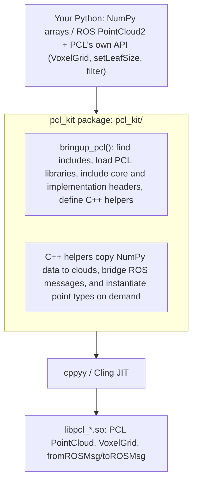

# pcl_kit: using PCL from Python via cppyy

**Date:** 2026-07-11 · **Env:** pixi `pcl` (robostack-jazzy + conda-forge),
`pcl 1.15`, `ros-jazzy-pcl-conversions`, `eigen 3`, `cppyy 3.5.0`, Python 3.12.13,
linux-64. **Question:** can the official PCL C++ workflow (VoxelGrid and friends)
be driven from Python, with NumPy arrays and ROS 2 `PointCloud2` messages flowing
in and out, with minimal glue and no code generation, given PCL has no maintained
Python binding?

**Result:** Yes. Both the ROS pipeline and a custom point type passed. The kit
follows PCL's C++ API and handles cppyy setup and conversions. In the pipeline
benchmark, pcl_kit had about 15x lower latency and used about 9x less CPU than the
rclpy+NumPy baseline. The demos have nearly the same number of user code lines.

(For the motivation and a C++-vs-Python side-by-side, see [WHY.md](WHY.md); for the
API and copy-paste patterns, see [SKILL.md](SKILL.md).)

---

## How the kit works

Bringup locates the install, includes PCL core and implementation headers, and
loads the required `libpcl_*.so` libraries. Cling can then instantiate
`PointCloud<T>`, `VoxelGrid<T>`, and `PCLBase<T>` for point types beyond the
precompiled ones. The NumPy-to-cloud copies run in C++; a Python per-point loop was
about 90x slower in the measured test. The kit also wraps `fromROSMsg` and
`toROSMsg`, so a C++ `sensor_msgs::msg::PointCloud2` can pass through without
Python creating point objects. Users call PCL APIs on the returned namespace.

pcl_kit follows the same setup pattern as bt_kit. It locates the installation,
loads headers and libraries, handles cppyy-specific operations in C++, and exposes
PCL APIs directly. The module contains about 136 lines of code, including about 100
lines of Python and a 36-line C++ helper.

---

## 1. Capability probe results

Each capability was tested in the `pcl` environment against the installed
PCL 1.15 headers and libraries. Each row records the result and evidence.

| # | Capability | Result | Evidence |
|---|---|:--:|---|
| 1 | **Bringup and JIT**: include `point_types.h` / `point_cloud.h` / `filters/voxel_grid.h`, load the `libpcl_*.so` set | **WORKS** | Warm JIT **~1.3 s** (point_types 0.91 s + point_cloud 0.10 s + voxel_grid 0.27 s); library load time was below the reported measurements. First run rebuilds the cppyy PCH in about a minute, once per machine. |
| 2 | **On-demand template instantiation** from pure Python (no cppdef kernel): construct `PointCloud<T>`, `VoxelGrid<T>`, set params, `filter` | **WORKS** | A 20-point cloud produced one voxel with a 0.05 m leaf for `PointXYZ`, `PointXYZINormal`, and `PointWithViewpoint`. The older python-pcl binding did not include the latter two types. `push_back` from Python did not segfault. |
| 3 | **NumPy <-> cloud** with copy measurements | **WORKS** | See section 3. One C++ copy each way; `(N,4)` in is a single `memcpy` (**0.49 ms** @100k), out-copy **0.35 ms**, zero-copy view **~0.1 ms**. Roundtrip exact (max abs err 0.0). |
| 4 | **ROS path**: `fromROSMsg`/`toROSMsg` on a C++ `sensor_msgs::msg::PointCloud2`, no Python per-point touch | **WORKS** | Full `fromROSMsg -> VoxelGrid -> toROSMsg` **4.32 ms/frame** @100k in isolation (**~2.5 ms** steady-state inside the live d02 pipeline). `toROSMsg`/`fromROSMsg` are callable **directly from Python** (cppyy deduces `PointT` from the cloud arg), no C++ helper needed. |
| 5 | **Custom point type** via `cppdef` + `POINT_CLOUD_REGISTER_POINT_STRUCT`, with a filter over it | **WORKS (2 caveats)** | A brand-new `struct MyLidarPoint { PCL_ADD_POINT4D; float intensity; uint16_t ring; }` registered and `VoxelGrid`-filtered (50 pts -> 2 voxels). Caveats below. |

All five probes passed. Probe 5 has two caveats described below.

### Limitations
- **Cling rejects the trailing `} EIGEN_ALIGN16;` attribute macro**, the standard
  PCL custom-point idiom. It parse-errors (`expected ';' after struct`) and, in a
  larger `cppdef`, the *transaction revert* can SIGSEGV the process with no Python
  traceback. **Fix:** spell it `struct alignas(16) MyPoint { ... };` (attribute
  prefix). Reliable.
- **A custom point type needs the template *impl* headers** so Cling instantiates
  `PCLBase<T>` / `VoxelGrid<T>` in-place, precompiled `.so`s only carry the stock
  types. Without `pcl/impl/pcl_base.hpp` and `pcl/filters/impl/voxel_grid.hpp` you
  get `IncrementalExecutor ... symbol ... unresolved`. The kit includes both at
  bringup, so custom types work out of the box.
- **The NumPy-to-cloud copy runs in C++.** A Python `push_back` loop over 100k
  points took **~45.7 ms**, compared with **~0.5 ms** for the C++ memcpy (~90x).
  Building the aligned point vector from Python can cause a cppyy segmentation fault.
  The kit copies data in a `cppdef` helper using `uintptr_t`.
- **`rclcpp::Time` has no `to_msg()` method.** Setting a stamp with `node.get_clock().now().to_msg()` throws. Set stamps in C++ or leave
  them; d02 does not need them (it measures processing latency).
- **Interpreter-exit teardown** (the live d02 pipeline drives rclcpp): d02
  previously exited with `os._exit(0)` because of a suspected static-destructor
  crash. An investigation found no reproducible crash on the current stack. Both d02
  and d03 now exit normally. rclcppyy registers an
  **ordered teardown** (`rclcppyy.shutdown_rclcpp` on `cppyy_kit`'s atexit hook)
  that brings the rclcpp context / DDS layer down before Python finalization; see
  COMMON_PATTERNS.md §14 and the `test/test_clean_exit.py` tripwire. pcl_kit holds
  no process-global C++ state, so it registers no teardown of its own.

---

## 2. API design

The v0 surface returns the real `pcl` namespace and you use PCL's own names on it:
`pcl.PointCloud[pcl.PointXYZ]`, `pcl.VoxelGrid[pcl.PointXYZ]`, `setInputCloud`,
`setLeafSize`, `filter`, exactly the C++ tutorial. The kit adds only what cppyy
makes awkward:

| Kit surface | Purpose |
|---|---|
| `bringup_pcl(with_ros=True)` | Idempotent. Include paths + core/impl headers + `libpcl_*.so` loads + `cppdef` glue. `with_ros=False` skips the ~1.9 s pcl_conversions JIT for NumPy-only work. |
| `cloud_from_numpy(array)` | `(N,3)`/`(N,4)` float array -> `PointCloud<PointXYZ>` in **one C++ copy** (memcpy for `(N,4)`, strided for `(N,3)`). |
| `cloud_to_numpy(cloud, copy=True)` | Cloud -> `(N,3)` float32. `copy=True` is a safe strided copy; `copy=False` is a near-free zero-copy view that aliases PCL storage. |
| `cloud_from_msg(msg, point_type=None)` | `sensor_msgs::msg::PointCloud2` -> `PointCloud<T>` via `fromROSMsg`, no Python per-point touch. `point_type` defaults to `PointXYZ`. |
| `msg_from_cloud(cloud, msg=None)` | `PointCloud<T>` -> `PointCloud2` via `toROSMsg`. |

Use other PCL APIs, including filters, KdTree, and segmentation, directly through
the returned namespace. The kit does not wrap them.

---

## 3. NumPy and ROS bridge: copy counts (100,000 float32 points)

`pcl::PointXYZ` is a **16-byte** aligned struct (`x,y,z` at offsets 0/4/8, 4 bytes
padding). An `(N,4)` float32 array maps to point storage with one `memcpy`. An
`(N,3)` array needs a strided copy that skips the padding lane. Zero-copy input is
not possible because NumPy and PCL own separate buffers. Zero-copy output is
possible as a view, but the cloud must stay alive.

| Direction | Path | What copies where | Cost @100k |
|---|---|---|--:|
| NumPy -> cloud | `(N,4)` memcpy | one `std::memcpy`, NumPy buffer -> PCL aligned storage | **0.49 ms** |
| NumPy -> cloud | `(N,3)` strided | one strided C++ loop (drops padding lane) | **0.70 ms** |
| NumPy -> cloud | Python `push_back` loop *(anti-pattern)* | per-point Python->C++ crossing | 45.7 ms |
| cloud -> NumPy | `copy=True` strided | one strided C++ loop -> private `(N,3)` buffer | **0.35 ms** |
| cloud -> NumPy | `copy=False` view | **no copy**, `(N,4)` view aliases PCL storage (must keep cloud alive) | ~0.11 ms |
| ROS <-> cloud | `fromROSMsg`->`VoxelGrid`->`toROSMsg` | all in C++, zero Python per-point touch | **4.32 ms/frame** |

Roundtrip (`cloud_from_numpy` -> `cloud_to_numpy`) is bit-exact (max abs err 0.0).
The measured cost is one C++ `memcpy`, about 0.5 ms. This is faster than a
Python-loop conversion. The ROS path does not create Python point objects.

---

## 4. Pipeline benchmark: pcl_kit (d02) and rclpy+NumPy (d03)

Identical work on both sides: a synthetic 100k-point `PointCloud2` published at
**10 Hz**, a **0.05 m VoxelGrid**, republished. d02 keeps every cloud in C++
(`fromROSMsg` -> PCL VoxelGrid -> `toROSMsg`); d03 is a hand-written
alternative (`read_points_numpy` -> NumPy centroid-per-voxel -> `create_cloud_xyz32`).
Both produced 8000 points. psutil sampled CPU use for the process and its children
during steady state, using the method in `scripts/benchmarks/run_benchmarks.py`.
The measurement used a shared machine, so treat the comparison as provisional.

| Variant | avg lat | p99 lat | CPU% @10 Hz | max msgs/s* | user LOC |
|---|--:|--:|--:|--:|--:|
| **pcl_kit (C++ end-to-end)** | **3.8 ms** | 8.7 ms | **6.9 %** | **261** | 76 |
| rclpy + NumPy baseline | 56.5 ms | 66.3 ms | 60.5 % | 18 | 77 |

\* Estimated from average per-frame latency (1000 / avg_lat_ms). This is the rate each
single-threaded pipeline could sustain at maximum load.

**Results:**
- Latency was about 15x lower and CPU use about 9x lower. The demos had similar
  line counts (76 and 77 lines).
- The baseline's cost is dominated by `np.unique(axis=0)` (a full sort of 100k
  rows) for the voxel keys. This reflects a direct NumPy implementation. A hand-tuned NumPy voxelizer could narrow the gap, but not the LOC or the
  serialize/deserialize overhead d03 pays that d02 skips entirely.
- Both pipelines kept up at 10 Hz. In this run, pcl_kit used 6.9% CPU and the
  baseline used 60.5%. The measured maximum rates were about 261 and 18 messages/s.
  These measurements do not predict performance on a robot.
- Steady-state d02 latency is ~2.5 ms; the 3.8 ms avg reflects early-frame warmup
  and shared-machine contention during the window.

### 4b. Compile cache reduces first-frame JIT (2026-07-12)

The showcase's frame-0 cost is dominated not by our bridge glue (the NumPy memcpy
is ~30 ms) but by cppyy JIT-instantiating **library** template methods on first
use: `pcl::VoxelGrid<PointXYZ>` ~594 ms and `pcl::toROSMsg<PointXYZ>` ~593 ms
(measured). A freeze/PCH does not touch these (they are codegen, not header parse),
and `warmup()` only relocates them.

The compile cache moves the VoxelGrid cost into a compiled `.so`:
`pcl_kit.voxel_downsample(cloud, leaf)` runs a `VoxelGrid<PointXYZ>` compiled once
via `cppyy_kit.cppdef_cached` (bringup `_adopt_glue()` caches the bridge glue +
this helper together; it falls back to the Python-driven `pcl.VoxelGrid[...]` mirror
path when no compiler is present). Measured (`bench-cache-pcl`, cold subprocesses):

| d02 frame-0 (from_msg -> voxel -> to_msg) | first frame |
|---|--:|
| JIT (Python VoxelGrid) | ~681 ms |
| **compile-cached voxel** | **~88 ms** (~7.7×) |

The VoxelGrid step itself is ~594 ms → ~5 ms. The one-time `.so` build (~3 s, PCL
headers are heavy) is paid at first bringup per machine, not per frame. The
residual ~88 ms is `fromROSMsg`'s first-use (~56 ms) plus cppyy's call wrappers to
our entry points. `toROSMsg` and `fromROSMsg` could use the same compiled
conversion helper; they currently run through `warmup()`. Mechanism and cross-kit
measurements: `docs/FREEZE.md` §4.

---

## 5. Gaps and next steps

1. **NumPy bridge is PointXYZ-only.** `cloud_from_numpy` / `cloud_to_numpy` model
   the `x,y,z` float path. Intensity/RGB/normal fields don't round-trip through the
   NumPy bridge yet (they *do* round-trip through the ROS `PointCloud2` path, and
   via a user `cppdef` helper). A structured-dtype bridge (per-field) is the
   obvious next step.
2. **Custom point types need a `cppdef` block**, plus the two caveats in section 1
   (`alignas(16)` prefix; include the impl headers). The kit enables it but does
   not (yet) offer a Python helper to declare a point struct, you write the
   `POINT_CLOUD_REGISTER_POINT_STRUCT` C++.
3. **Only VoxelGrid's impl header is pre-included.** Other filters/algorithms over
   *novel* point types (e.g. `PassThrough<MyPoint>`, `SACSegmentation<MyPoint>`)
   need their own `impl/*.hpp` included first, or you get unresolved-symbol errors.
   Stock point types (`PointXYZ`, ...) are fine straight from the `.so`.
4. **`cloud_to_numpy(copy=False)` lifetime.** The zero-copy view aliases PCL
   storage; if the cloud is freed the view dangles. The kit pins the cloud on the
   backing buffer best-effort, but the contract is "keep the cloud alive."
5. **Bringup pulls all ament include paths.** `_ensure_ros()` reuses rclcppyy's
   `add_ros2_include_paths()` (every package's include dir). Cheap, but it means
   the ROS path is coupled to a rclcppyy import.
6. **No PCD/PLY I/O wired.** `pcl::PCDReader`/`Writer` are reachable via cppyy but
   not surfaced; the demos use synthetic/NumPy clouds, not the tutorial's `.pcd`.
7. **GIL / threading.** All shown pipelines are single-threaded. A Python callback
   still holds the GIL around the C++ filter call (the call itself is C++, so it is
   fine), but multi-threaded executors ticking Python callbacks contend as usual.
8. **First-run PCH rebuild.** The very first cppyy use on a machine rebuilds the
   precompiled header (~a minute). One-time, per machine; not per process.

---

## 6. Generic lessons for cppyy_kit

These generalized beyond PCL and are now maintained as the shared,
library-independent catalog in **[../docs/COMMON_PATTERNS.md](../docs/COMMON_PATTERNS.md)**
(the recipe, `load_library` rule, containers-in-C++/`uintptr_t` bulk copy,
on-demand template instantiation via impl headers, Cling attribute/`cppdef`
traps, direct template-function calls, and mirror-don't-sugar), implemented in
`cppyy_kit/__init__.py` and confirmed by both pcl_kit and bt_kit. The
PCL-specific evidence stays in this report (§1 probe matrix, §3 copy accounting,
§4 showcase benchmark, §5 gaps).

---

## 7. Results

The tests show that Python can run the PCL VoxelGrid workflow through PCL's API.
The NumPy bridge uses one C++ copy; the ROS path needs no per-point Python work.
Custom point types also work, and PCL has no maintained Python binding. In the
pipeline benchmark, pcl_kit had about 15x lower latency and used about 9x less CPU
than the NumPy baseline. The demo scripts have similar line counts. The C++ data
path avoids converting each point to a Python object.

Remaining work includes NumPy support for more fields, additional filter
implementation headers, and a point-struct helper. Keep using PCL API names and
handle cppyy operations inside the kit, including buffer copies and custom-type
alignment.

**Next investments, in priority order:** (a) structured-dtype NumPy bridge for
intensity/RGB/normal fields; (b) a `register_point_type(...)` helper that emits the
`alignas(16)` struct + `POINT_CLOUD_REGISTER_POINT_STRUCT` and includes the needed
impl headers; (c) surface a couple more filters (PassThrough, StatisticalOutlier)
with their impls pre-included; (d) PCD/PLY I/O passthrough; (e) precompiled cppyy
dictionary to drop the JIT bringup.
